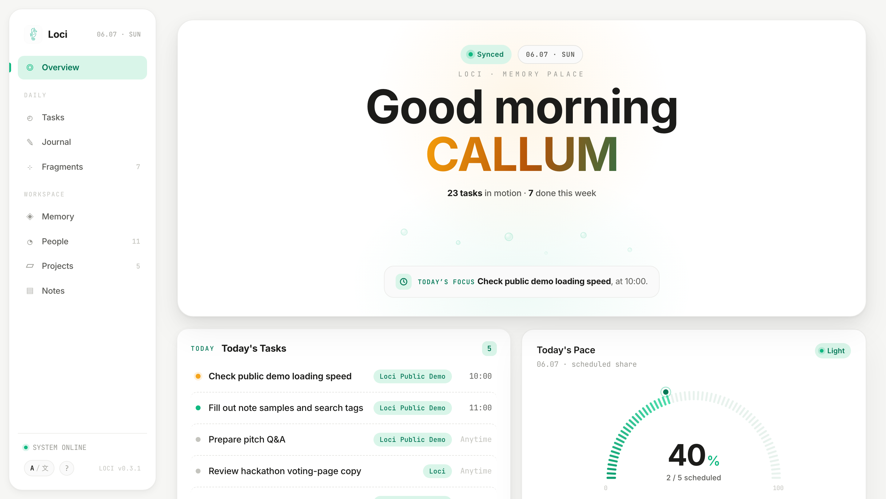
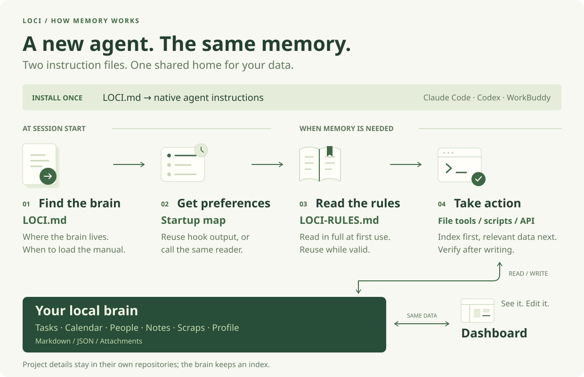

<p align="center">
  
</p>

<p align="center">
  <strong>A local memory and data layer shared across agents. AI helps you capture it; you can inspect and edit it.</strong>
</p>

<p align="center">
  <a href="LICENSE"></a>
  <a href="https://github.com/codesstar/loci/stargazers"></a>
  
</p>

<p align="center">
  <a href="README.md">中文</a> | English
</p>

## What is Loci?

AI tools often keep separate memories. Switching agents may mean explaining your preferences, tasks, and project background again, while scattered records are hard to organize.

Loci keeps this information in your own local “brain” directory. Instructions in each agent's native entry point describe where to read, what is worth saving, and how to write it. Agents connected to the same brain can retrieve shared context that has already been saved.

Memory, tasks, schedules, contacts, and knowledge use Markdown, JSON, and attachments. Open the files directly or inspect and edit them through the Dashboard. No external database or cloud memory service is required; the Dashboard is a local Node.js service.

## What can it do?

| Capability | Use |
| --- | --- |
| Personal memory | Save names, language preferences, personal facts, reflections, and decisions; retrieve them when relevant |
| Tasks and schedules | Manage todos, meetings, and time blocks; a timed todo remains a task and is not automatically copied to the calendar |
| Project context | Keep state, technical decisions, and development todos in the project repository; the brain holds an index |
| People and places | Record contacts, relationships, interactions, and relevant locations |
| Knowledge | Collect links, scraps, and attachments; index your own notes and research |
| Journals and review | Inspect activity records and organize recent work and saved information |

For example, tell a connected agent:

```text
Use English when replying to me.
Remind me to send the materials tomorrow at 9 AM.
Save this link with the note “interview reference”.
Remember this project, then tell me where we left off.
```

The agent's file and command tools perform the operations. Results depend on instruction loading, access to the brain, and correct execution; installing instruction files does not force a model to follow them.



## Install with your AI agent

Copy this into an agent that can read local files and run commands:

```text
Install Loci for me. Read and follow:
https://raw.githubusercontent.com/codesstar/loci/main/docs/AI-INSTALL.md
Reuse an existing brain and preserve all data. Connect this client and verify the result.
```

You need **Node.js 18+ and Git**. No npm package or npx installer is required. The agent downloads the repository and uses one cross-platform Node installer. [AI installation and upgrade guide](docs/AI-INSTALL.md).

Built-in entry adapters: Claude Code, Codex and WorkBuddy. Other clients, including Qwen office and Doubao work tools, require a verified instruction entry and local file/command access; they are not claimed as tested integrations. Hooks are optional. Validate the actual client in a new conversation after installation.

Already using Loci and adding another agent? Send this directly to the **new client**:

```text
Connect yourself to my existing Loci brain. Read and follow:
https://raw.githubusercontent.com/codesstar/loci/main/docs/AI-CONNECT.md
Find the brain yourself, preserve my data, and do not create another installation.
```

The agent checks its capabilities, finds the existing brain and configures its entry. You do not need to find paths or edit configuration.

To open the Dashboard, say: **“Open my Loci Dashboard using my existing brain.”** Keep its local service running. Saving a reminder does not prove delivery.

[Full user guide (中文) →](https://www.tryloci.com/handbook/)

## One entry, one manual, shared data

<picture>
  <source media="(prefers-color-scheme: dark)" srcset="docs/assets/architecture-en-dark.svg" />
  
</picture>

- **`LOCI.md`** provides the brain path, startup preference reader and triggers to read the manual.
- **`LOCI-RULES.md`** contains the complete operating rules. Read it at first Loci use, reuse while valid, reload after changes or lost context.
- **Data stays on demand.** Tasks, contacts and notes are not loaded at startup. Full project memory lives in its own repository.
- **Hooks are an optional delivery mechanism**, using the same preference reader as the instruction fallback. They do not create a second rulebook.

Ordinary requests avoid a full manual read; the first Loci operation pays that cost once. Instruction files guide an agent but cannot force model compliance. [Architecture and trade-offs](docs/architecture.md) · [Short entry](LOCI.md) · [Full manual](LOCI-RULES.md).

## Data and privacy

Files stay on your machine and can be backed up, inspected, and moved. Loci does not require a separate cloud memory service. When an agent calls a model, accesses the network, or uses other tools, data handling follows the configuration of that agent and those services. Local storage does not imply fully offline model use.

Loci is an MIT-licensed open-source project. Models and third-party services may have their own charges.

## Documentation and contributions

- [Full user guide (中文)](https://www.tryloci.com/handbook/)
- [English getting started guide](docs/getting-started.md) · [中文指南](docs/getting-started.zh-CN.md)
- [AI installation](docs/AI-INSTALL.md)
- [Connect a new agent to an existing brain (中文)](docs/connect-existing-brain.md) · [Entry, startup map, and rules explained (中文)](docs/context-explained.md)
- [Dashboard](docs/dashboard.md) · [API](docs/api.md)
- [Example brain](examples/alex/)
- [Contributing](CONTRIBUTING.md) · [MIT License](LICENSE)

Report reproducible problems and suggestions in [Issues](https://github.com/codesstar/loci/issues), or submit a pull request.
