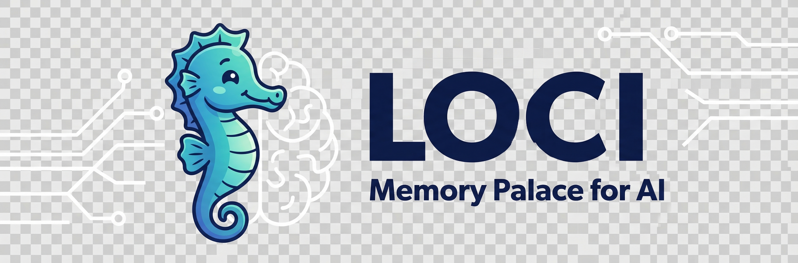

<p align="center">
  
</p>

<h1 align="center">Loci — Memory Palace for AI</h1>

<p align="center">
  <strong>Not a single file. A full brain architecture for Claude Code.</strong>
</p>

<p align="center">
  <a href="LICENSE"></a>
  <a href="https://github.com/codesstar/loci/stargazers"></a>
  
  
</p>

<p align="center">
  English | <a href="README.zh-CN.md">中文</a>
</p>

---

## The Problem

Your AI doesn't remember you.

Every conversation starts from zero. You re-introduce yourself. You re-explain your project. You re-describe your preferences. The thing you spent an hour figuring out yesterday? Gone. The decision you made last week? Never happened.

And it's not just forgetting between sessions. Chat long enough and the context fills up — your AI starts repeating itself, getting confused, forgetting things you said 20 minutes ago. You restart. Everything you built up is gone.

Worse: your memories are scattered. Claude Code's auto-memory is a flat file that gets messy over time. Cursor's memory lives in `.cursorrules` and breaks across projects. Every tool remembers its own fragments, but nothing holds the full picture of you.

**What if your AI actually knew you — and that knowledge was yours forever?**

## The Solution

Loci gives your AI a real brain. Everything it learns about you is saved as plain Markdown files on your machine. No server, no subscription, no lock-in. Your memories belong to you.

```
Day 1:       "I'm a frontend developer. I prefer simple solutions
              over clever ones. I'm building a fitness app."
              Your AI remembers. Permanently.

Week 2:      Context is full. AI is slowing down. You restart.
             "Pick up where I left off."
             "You were building the workout tracker. You decided on
              a card layout because of mobile. The exercise list is
              done. Next up: the timer component. Ready?"

Month 3:     You open a completely different project.
             "How should I structure this?"
             "Based on what I know about you: you like flat folder
              structures, you always regret adding too many abstractions
              early, and you prefer starting with a working prototype.
              Here's what I'd suggest..."

Year 1:      You look back.
             "How have I changed this year?"
             "In January you called yourself 'learning to code.' By June
              you were mass-shipping features. Your decision-making got
              faster — early decisions took days, now you decide in hours.
              You've grown a lot."
```

The longer you use it, the better it knows you. Your preferences, your patterns, your growth — across every conversation, every project, every context reset. It never forgets, and it never disappears.

**Your AI is no longer a stranger. It's the one assistant that actually knows who you are.**

### Why Loci?

- **It's yours.** Every memory is a file on your machine. No server, no subscription. Cancel anything, switch any tool — your brain stays with you.
- **It's private.** Your identity, your decisions, your goals — stored locally. No one else can see it. Not even us.
- **It grows with you.** Day one, it knows your name. Month three, it knows your patterns. Year one, it can tell you how you've changed.
- **It never crashes.** Session dies? Context full? Computer restarts? Save and recover in 10 seconds. Your AI picks up exactly where you left off.

### "I already have CLAUDE.md — why do I need this?"

CLAUDE.md is a sticky note. Loci is a second brain.

- **CLAUDE.md is one file.** Loci is 30+ structured modules — identity, decisions, tasks, daily plans, journal, evolution — that stay clean no matter how much you use them.
- **CLAUDE.md is per-project.** Loci connects all your projects. A lesson you learned in Project A becomes a warning in Project B — automatically.
- **CLAUDE.md degrades with use.** The file grows, context bloats, AI slows down. Loci uses layered loading — only relevant memory enters context. Heavy use makes it smarter, not slower.
- **CLAUDE.md doesn't manage your work.** Loci gives you morning briefings, task tracking, pattern detection, daily journals, and a visual dashboard.

Loci actually *uses* CLAUDE.md — it's one of the 30+ files in the system. The difference is everything else around it.


---

## Quick Start

Requires [Claude Code](https://docs.anthropic.com/en/docs/claude-code/overview).

```bash
git clone https://github.com/codesstar/loci.git my-brain
cd my-brain
claude
```

That's it. Claude detects the new brain, asks you a few questions, and sets everything up through conversation. Takes about 2 minutes.

> **Alternative**: Run `bash install.sh` instead of `claude` — it checks prerequisites, disconnects from the template repo, and installs slash commands before launching Claude.
>
> **Windows?** Use [WSL](https://learn.microsoft.com/en-us/windows/wsl/install) or Git Bash.
>
> **Want to see what a brain looks like?** Check out [`examples/alex/`](examples/alex/) — a full brain with 3 months of history.
>
> **New to Loci?** Read the **[Getting Started Guide](docs/getting-started.md)** for a complete walkthrough.

---

## What Happens After Setup

You don't learn Loci. You just talk to your AI, and four things start happening:

### It remembers what matters

Spend 30 minutes figuring something out with your AI? That knowledge is saved automatically — the decision, the reasoning, and the alternatives you rejected.

```
You: "We compared Vercel, Railway, and self-hosted. Going with Railway
      — Vercel is too expensive at our scale, self-hosted is too much
      ops work for a two-person team."

Got it — saved your hosting decision with the tradeoffs.
```

Next month, when you're wondering "why aren't we on Vercel?" — your AI already knows the full story. You figured it out once. You never have to figure it out again.

### It connects your projects

Link any project folder with one command. Mistakes you made in Project A become warnings in Project B.

```
Brain (your memory)
 ├── Main App         "Deployment took 6 hours because we forgot
 │                     to set up environment variables for the
 │                     staging environment. Checklist created."
 │
 ├── Side Project     "You're about to deploy this. Remember your
 │                     main app took 6 hours because of missing
 │                     env vars. Here's the checklist you made."
 │
 └── Client Work      "New deployment here too — applying your
                       env var checklist from the start."
```

### It finds patterns you miss

Every morning, Loci reviews what changed and surfaces insights:

```
Morning briefing:
  - You've started 3 new side projects this month but finished
    none of them. Maybe ship one before starting another?
  - "Write the project README" has been on your list for 12 days.
    Do it today or drop it?
  - You estimated the payment integration would take 2 days.
    Your last 3 integrations took 2x your estimates.
```

### It survives context resets

Long session? Context window full? AI getting slow? Just save and restart.

```
> save everything before I restart
  Done — synced all decisions and progress to your brain.

(open a new terminal)

> picking up where I left off
  You were building the notification system. You decided on
  email + in-app (no SMS — too expensive for now). The email
  templates are done, you were about to wire up the trigger
  logic. The file is src/notifications/triggers.ts. Ready?
```

Not "what project are you working on?" — it knows exactly where you were, what you decided, and what file you had open.

### It grows with you

Your skills change. Your focus shifts. Loci tracks the evolution — current state stays lean, history is preserved for when you want to reflect.

```
January:  "data engineer, mass-producing dashboards"
April:    "data engineer → building my own analytics product"
July:     "founder, shipped v1, first 50 users"
          evolution.md records each transition and what triggered it
```

---

## How It Works

| Concept | What it does | Why it matters |
|---------|-------------|----------------|
| **Smart saving** | Extracts decisions, tasks, and insights from conversation — never saves raw chat transcripts | Your memory stays clean and searchable, not a wall of text |
| **Layered loading** | Loads only what's relevant to the current conversation. Archives stay out of the way until needed | Fast responses, even after months of accumulated memory |
| **Cross-project sync** | Your brain is the hub, projects are spokes. Important info flows automatically | Decisions in one project inform work in others |
| **Daily review** | Morning briefing summarizes yesterday, surfaces patterns, flags stale tasks | You start each day with full context in 10 seconds |
| **Growth tracking** | When your identity or goals change, old versions are archived automatically | You can look back and see how you've evolved |
| **Git-native** | Everything is Markdown files in a git repo. `git diff` shows what your AI learned. `git log` is your memory timeline | Full version history, works offline, you own your data |

> **Deep dive**: [How It Works](docs/how-it-works.md) — one doc that covers the entire system.

---

## What It Feels Like In Practice

**"I stopped re-explaining my architecture"** — Marcus opens his terminal Monday morning. His AI already knows the migration strategy they debated on Friday, the edge cases they found, and why they rejected the simpler approach.

**"It saved me from repeating a mistake"** — Priya is setting up deployment for a new service. Her AI reminds her that the last time she used that hosting provider, DNS propagation took 48 hours and broke the launch timeline. She switches providers before wasting a day.

**"It told me to go to bed"** — It's 11:30pm and Dev is still chasing a bug. His AI says "you've been circling the same 3 files for an hour — sleep on it" — then saves exactly where he was so tomorrow's first message picks up mid-thought.

> More: **[User Stories](docs/user-stories.md)** — what Loci actually feels like in daily use.

---

## Directory Structure

```
my-brain/
├── CLAUDE.md              # AI operating system (reads this first)
├── plan.md                # Life direction & goals
├── inbox.md               # Quick capture
├── me/                    # Identity, values, skills, evolution
├── tasks/                 # active.md, daily plans, journal
├── decisions/             # Decision records with full context
├── archive/               # Completed items (never deleted)
├── .loci/                 # System internals (hooks, dashboard, config)
│   └── links/             # Connected projects
├── templates/             # File & command templates
└── docs/                  # Full documentation
```

Extension modules created on demand: `finance/`, `people/`, `content/`, `references/`

---

## Commands

| Command | What it does |
|---------|-------------|
| `/loci-link` | Connect a project folder to your brain |
| `/loci-sync` | Manual save + sync (flags: `--local`, `--dry-run`) |
| `/loci-consolidate` | Review recent changes and surface patterns (e.g. `/loci-consolidate 7` for a weekly review) |
| `/loci-settings` | Configure what a project syncs to your brain |
| `/loci-brain-settings` | Configure persistence mode and notifications |
| `/loci-scan` | Re-scan a project and update its profile |

---

## Compatibility

Loci is **built for Claude Code**. Other AI editors can read the memory files but won't have the full experience.

| Tool | Support | Notes |
|------|---------|-------|
| **Claude Code** | **Full** | All features work natively |
| **Cursor** | Partial | Memory + auto-save via `.cursorrules` |
| **Windsurf** | Partial | Memory + auto-save via `.windsurfrules` |
| **Cline** | Partial | Memory + auto-save via `.clinerules` |

> Using another editor? See **[Other Editors Guide](docs/other-editors.md)**.
>
> Loci's memory is plain Markdown — any AI tool can read it. The full experience (slash commands, auto-save, hooks) requires Claude Code.

---

## Documentation

| Doc | What you'll learn |
|-----|-------------------|
| **[Getting Started](docs/getting-started.md)** | Step-by-step setup and first conversation |
| **[How It Works](docs/how-it-works.md)** | Complete system overview in one page |
| **[User Stories](docs/user-stories.md)** | What Loci feels like in daily use |
| **[Architecture](docs/architecture.md)** | Three-layer memory system in depth |
| **[Synapse](docs/synapse.md)** | Multi-project sync and routing |
| **[Distillation](docs/distillation.md)** | How conversations become structured knowledge |
| **[Dashboard](docs/dashboard.md)** | Visual overview of your brain |
| **[Privacy](docs/privacy.md)** | Data protection and what stays where |
| **[Roadmap](docs/roadmap.md)** | What's coming next |

---

## Contributing

Contributions welcome — bug fixes, features, docs, or just sharing how you use Loci. Please open an issue first for large changes. See [CONTRIBUTING.md](CONTRIBUTING.md).

## License

MIT. See [LICENSE](LICENSE).

---

<p align="center">
  <strong>Loci</strong> is built by <a href="https://github.com/codesstar">Callum</a>.<br/>
  If this gives your AI a better memory, consider giving it a star.
</p>
