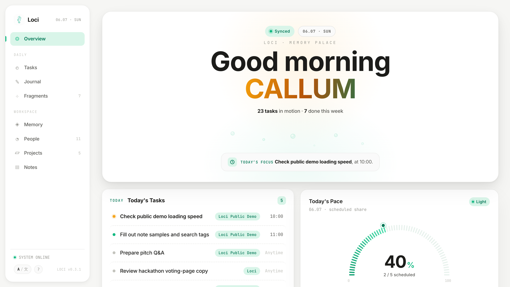

<p align="center">
  
</p>

<p align="center">
  <strong>The first agent-native memory system. A full brain architecture for AI.</strong>
</p>

<p align="center">
  <a href="LICENSE"></a>
  <a href="https://github.com/codesstar/loci/stargazers"></a>
  
  
</p>

<p align="center">
  English | <a href="README.zh-CN.md">中文</a>
</p>

---

## The Problem

Your AI doesn't remember you.

Every conversation starts from zero. You re-introduce yourself. You re-explain your project. You re-describe your preferences. The thing you spent an hour figuring out yesterday? Gone. The decision you made last week? Never happened.

And it's not just forgetting between sessions. Chat long enough and the context fills up — your AI starts repeating itself, getting confused, forgetting things you said 20 minutes ago. You restart. Everything you built up is gone.

Worse: your memories are scattered. Claude Code's auto-memory is a flat file that gets messy over time. Cursor's memory lives in `.cursorrules` and breaks across projects. Every tool remembers its own fragments, but nothing holds the full picture of you.

**What if your AI actually knew you — and that knowledge was yours forever?**

## The Solution

Loci gives your AI a real brain. Everything it learns about you is saved as plain Markdown files on your machine. No server, no subscription, no lock-in. Your memories belong to you.

```
Day 1:       "I'm a frontend developer. I prefer simple solutions
              over clever ones. I'm building a fitness app."
              Your AI remembers. Permanently.

Week 2:      Context is full. AI is slowing down. You restart.
             "Pick up where I left off."
             "You were building the workout tracker. You decided on
              a card layout because of mobile. The exercise list is
              done. Next up: the timer component. Ready?"

Month 3:     You open a completely different project.
             "How should I structure this?"
             "Based on what I know about you: you like flat folder
              structures, you always regret adding too many abstractions
              early, and you prefer starting with a working prototype.
              Here's what I'd suggest..."
```

The longer you use it, the better it knows you. Your preferences, your patterns, your growth — across every conversation, every project, every context reset. It never forgets, and it never disappears.

**Your AI is no longer a stranger. It's the one assistant that actually knows who you are.**

### Why Loci?

- **It's yours.** Every memory is a file on your machine. No server, no subscription. Cancel anything, switch any tool — your brain stays with you.
- **It's private.** Your identity, your decisions, your goals — stored locally. No one else can see it. Not even us.
- **It grows with you.** Day one, it knows your name. Month three, it knows your patterns. Year one, it can tell you how you've changed.
- **It never crashes.** Session dies? Context full? Computer restarts? Save and recover in 10 seconds. Your AI picks up exactly where you left off.
- **It collects for you.** Toss in an article, a link, a half-formed idea. Forget about it. Weeks later, when it's relevant, your AI surfaces it at exactly the right moment.

### "I already have CLAUDE.md — why do I need this?"

CLAUDE.md is a sticky note. Loci is a second brain.

- **CLAUDE.md is one file.** Loci is 30+ structured modules — identity, decisions, tasks, daily plans, journal, evolution — that stay clean no matter how much you use them.
- **CLAUDE.md is per-project.** Loci connects all your projects. A lesson you learned in Project A becomes a warning in Project B — automatically.
- **CLAUDE.md degrades with use.** The file grows, context bloats, AI slows down. Loci uses layered loading — only relevant memory enters context. Heavy use makes it smarter, not slower.
- **CLAUDE.md doesn't manage your work.** Loci gives you morning briefings, task tracking, pattern detection, daily journals, and a visual dashboard.

Loci actually *uses* CLAUDE.md — it's one of the 30+ files in the system. The difference is everything else around it.



---

## Quick Start

### Option 1 — Ask your AI to install it (recommended)

Loci is built for AI agents — so let yours install it. Paste this into Claude Code or Codex:

```text
Install Loci for me: https://github.com/codesstar/loci
Clone the repo, then follow docs/AI-INSTALL.md inside it.
```

Your AI clones the repo, asks your name, runs the scriptable setup, connects itself to the new brain, and verifies everything works. About a minute — and the first thing your AI ever does with its new memory is set it up for you.

### Option 2 — Installer (no AI needed)

One command. Loci gives Claude Code and Codex one shared local brain, so decisions and tasks saved in one tool are available to the other.

```bash
npx create-loci
```

The installer opens a browser setup wizard, creates your brain, detects Claude Code and Codex, and asks which tools should connect. Takes about 2 minutes. Prefer terminal setup? Run `npx create-loci --cli`.

### OpenClaw (experimental)

```bash
clawhub install loci-brain
```

### Manual Setup

```bash
git clone https://github.com/codesstar/loci.git ~/loci
cd ~/loci && ./setup.sh
```

Scripting it (or you're an AI reading this)? `./setup.sh --non-interactive --name "Alex"` skips the wizard — see `./setup.sh --help` and [docs/AI-INSTALL.md](docs/AI-INSTALL.md).

> **Note**: Without Claude Code or Codex CLI, Loci only works inside the brain directory. Global cross-project memory requires a tool that supports global instruction files.
>
> Prefer the old shell installer? `curl -fsSL https://raw.githubusercontent.com/codesstar/loci/main/install.sh | bash` still works.

> **Windows?** Use [WSL](https://learn.microsoft.com/en-us/windows/wsl/install) or Git Bash.
>
> **Want to see what a brain looks like?** Check out [`examples/alex/`](examples/alex/) — a full brain with 3 months of history.
>
> **New to Loci?** Read the **[Getting Started Guide](docs/getting-started.md)** for a complete walkthrough.

---

## Why "Loci"? And Why a Seahorse?

The **Method of Loci** is one of the oldest memory techniques in human history. Ancient Greek orators would mentally place each point of their speech in a room of an imaginary palace. To recall, they simply walked through the palace — every room held a memory, exactly where they left it.

That's what Loci does for your AI. Every decision, every preference, every lesson you've learned — placed in its own room, ready to be recalled at the right moment.

And the seahorse? In your brain, the **hippocampus** is the region responsible for forming and retrieving memories. The word "hippocampus" comes from Greek: *hippos* (horse) + *kampos* (sea creature) — it literally means **seahorse**. Neuroscientists named it that because the structure looks like one.

Our logo is a seahorse because Loci is the hippocampus of your AI — the part that turns fleeting conversations into lasting memory.

---

## What Happens After Setup

You don't learn Loci. You just talk to your AI, and five things start happening:

### It remembers what matters

Spend 30 minutes figuring something out with your AI? That knowledge is saved automatically — the decision, the reasoning, and the alternatives you rejected.

```
You: "We compared Vercel, Railway, and self-hosted. Going with Railway
      — Vercel is too expensive at our scale, self-hosted is too much
      ops work for a two-person team."

Got it — saved your hosting decision with the tradeoffs.
```

Next month, when you're wondering "why aren't we on Vercel?" — your AI already knows the full story. You figured it out once. You never have to figure it out again.

### It connects your projects

No command to learn. While you work inside a project, if your AI notices it's becoming real, it offers once — at the end of a conversation: "This project seems to be taking off. Want me to keep a memory for it here?"

Say yes, and Loci creates the project's own `.loci/` memory inside that repo. Your brain keeps only a one-line index entry pointing to it. Project memory belongs to the project; the brain aggregates and orchestrates. **Loci aggregates memory — it does not own it.**

```
Brain (your memory hub)
 ├── projects/index.md
 │    "Main app lives at ~/work/main-app — project memory in .loci/memory.md"
 │
 ├── me/, tasks/, decisions/
 │    your global preferences, tasks, and cross-project decisions
 │
 └── project repo/.loci/
      memory.md       short restart context
      profile.md      stable project details
      progress/       project progress, one file per month
      decisions/      the project's own decision stream
      todo.json       the project's development todos
```

### It finds patterns you miss

Every morning, Loci reviews what changed and surfaces insights:

```
Morning briefing:
  - You've started 3 new side projects this month but finished
    none of them. Maybe ship one before starting another?
  - "Write the project README" has been on your list for 12 days.
    Do it today or drop it?
  - You estimated the payment integration would take 2 days.
    Your last 3 integrations took 2x your estimates.
```

### It survives context resets

Long session? Context window full? AI getting slow? Just save and restart.

```
> save everything before I restart
  Done — synced all decisions and progress to your brain.

(open a new terminal)

> picking up where I left off
  You were building the notification system. You decided on
  email + in-app (no SMS — too expensive for now). The email
  templates are done, you were about to wire up the trigger
  logic. The file is src/notifications/triggers.ts. Ready?
```

Not "what project are you working on?" — it knows exactly where you were, what you decided, and what file you had open.

### It grows with you

Your skills change. Your focus shifts. Loci tracks the evolution — current state stays lean, history is preserved for when you want to reflect.

```
January:  "data engineer, mass-producing dashboards"
April:    "data engineer → building my own analytics product"
July:     "founder, shipped v1, first 50 users"
          evolution.md records each transition and what triggered it
```

---

## How It Works

| Concept | What it does | Why it matters |
|---------|-------------|----------------|
| **Smart saving** | Extracts decisions, tasks, and insights from conversation — never saves raw chat transcripts | Your memory stays clean and searchable, not a wall of text |
| **Layered loading** | Loads only what's relevant to the current conversation. Archives stay out of the way until needed | Fast responses, even after months of accumulated memory |
| **Cross-project memory** | Each serious project keeps its own memory in its repo (`.loci/memory.md` + `.loci/profile.md` + `.loci/progress/` + `.loci/decisions/`); your brain holds only a one-line index. Loci aggregates memory, it does not own it | Lessons stay where they belong, and your AI knows where to find them from any project |
| **Daily review** | Morning briefing summarizes yesterday, surfaces patterns, flags stale tasks | You start each day with full context in 10 seconds |
| **Growth tracking** | When your identity or goals change, old versions are archived automatically | You can look back and see how you've evolved |
| **Git-native** | Everything is Markdown files in a git repo. `git diff` shows what your AI learned. `git log` is your memory timeline | Full version history, works offline, you own your data |

> **Deep dive**: [How It Works](docs/how-it-works.md) — one doc that covers the entire system.

---

## Dashboard

Loci includes an optional local dashboard for seeing the shape of your brain: today's work, project memory, notes, people, decisions, fragments, and the activity around them.


```bash
loci
```

The `loci` command (installed by setup) starts the server and opens the dashboard in your browser. It works from any directory — `loci stop` shuts it down, `loci help` lists the rest. Prefer doing it by hand? `node .loci/dashboard/server.js` from the brain directory does the same, then open:

```text
http://localhost:8765
```

The dashboard reads your brain files live on every request. On a fresh install it starts out clean and empty — it fills up as your AI saves memories. The same local server exposes the API Loci's live workflows use for tasks, schedule, journal, and project todos.

- **Overview**: Current focus, task velocity, memory mix, recent notes, decisions, and project progress
- **Tasks / Schedule**: Task pool and schedule timeline, kept strictly separate — a task is something to complete, a schedule item is a block of occupied time
- **Journal**: Daily/weekly/monthly reflections and AI summaries
- **Memory**: Identity, values, learned lessons, and growth history
- **People**: Relationship cards and contact context
- **Projects**: Connected project memory plus repo-local development todos
- **Notes / Fragments**: Your own notes from Obsidian/Feishu/Notion, inline notes, loose ideas, and references

The dashboard is a window into your brain, not a separate cloud system. User data stays in local Markdown and JSON files.

> **API docs**: [docs/api.md](docs/api.md) — local REST endpoints for reading and writing your brain.
>
> **Dashboard docs**: [docs/dashboard.md](docs/dashboard.md) — pages, data sources, and API behavior.

---

## Integrations

Loci currently focuses on Claude Code and Codex. Both can share the same local brain: a task, decision, preference, or project context saved in one tool is available to the other.

| Platform | Status |
|----------|--------|
| **Claude Code** | Primary support |
| **Codex** | Primary support |
| **Cursor / Windsurf / Cline** | Future adapters |
| **OpenClaw** | Experimental integration |

---

## What It Feels Like In Practice

**"I stopped re-explaining my architecture"** — Marcus opens his terminal Monday morning. His AI already knows the migration strategy they debated on Friday, the edge cases they found, and why they rejected the simpler approach.

**"It saved me from repeating a mistake"** — Priya is setting up deployment for a new service. Her AI reminds her that the last time she used that hosting provider, DNS propagation took 48 hours and broke the launch timeline. She switches providers before wasting a day.

**"It told me to go to bed"** — It's 11:30pm and Dev is still chasing a bug. His AI says "you've been circling the same 3 files for an hour — sleep on it" — then saves exactly where he was so tomorrow's first message picks up mid-thought.

> More: **[User Stories](docs/user-stories.md)** — what Loci actually feels like in daily use.

---

## Learn More

| | |
|---|---|
| **[Getting Started](docs/getting-started.md)** | Setup walkthrough and first conversation |
| **[How It Works](docs/how-it-works.md)** | Complete system overview |
| **[Project Overview](docs/project-overview.zh-CN.md)** (中文) | Positioning, architecture, and current state in one doc — Chinese only |
| **[User Stories](docs/user-stories.md)** | What daily use feels like |
| **[Commands & Structure](docs/getting-started.md#understanding-your-brain)** | Directory layout, slash commands, config |
| **[Other Editors](docs/other-editors.md)** | Cursor, Windsurf, Cline support |
| **[Privacy](docs/privacy.md)** | Data protection and what stays where |
| **[Roadmap](docs/roadmap.md)** | What's coming next |

---

## Contributing

Contributions welcome — bug fixes, features, docs, or just sharing how you use Loci. Please open an issue first for large changes. See [CONTRIBUTING.md](CONTRIBUTING.md).

## License

MIT. See [LICENSE](LICENSE).

---

<p align="center">
  <strong>Loci</strong> is built by <a href="https://github.com/codesstar">Callum</a>.<br/>
  If this gives your AI a better memory, consider giving it a star.
</p>
