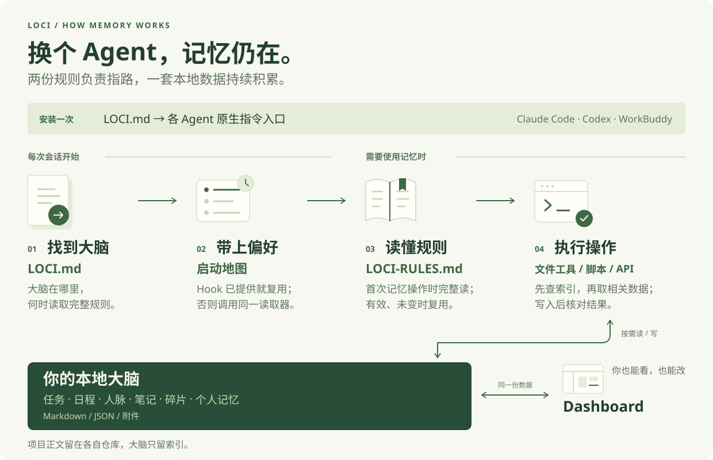

<p align="center">
  
</p>

<p align="center">
  <strong>跨 Agent 的本地记忆与数据层。AI 帮你记录，你随时可看、可改。</strong>
</p>

<p align="center">
  支持 Claude Code · Codex · Hermes · 千问工作 · 豆包工作 · Qoder · WorkBuddy
</p>

<p align="center">
  <a href="LICENSE"></a>
  <a href="https://github.com/codesstar/loci/stargazers"></a>
  
</p>

<p align="center">
  中文 | <a href="README.en.md">English</a>
</p>

## Loci 是什么

不同 AI 工具的记忆往往各自独立。换一个 Agent，偏好、任务和项目背景可能需要重新交代；记录散落在不同位置，也难以统一整理。

Loci 把这些内容放进你自己的本地“大脑”目录，通过各 Agent 的指令入口告诉它们：去哪里读、什么值得记、怎样写入。接入同一个大脑的 Agent，可以读取已经保存的共同上下文。

记忆、任务、日程、人脉和知识资料使用 Markdown、JSON 与附件保存。你可以直接打开文件，也可以通过 Dashboard 查看和修改。无需部署外部数据库或云端记忆服务；Dashboard 是在本机运行的 Node.js 服务。

## 能做什么

| 能力 | 用法 |
| --- | --- |
| 个人记忆 | 保存称呼、语言、个人资料、反思与决定，相关时读取 |
| 任务与日程 | 管理待办、会议和时间块；带时间的待办仍是任务，不自动复制进日历 |
| 项目上下文 | 在项目仓库保存状态、技术决定和开发待办，大脑只保留索引 |
| 人脉与地点 | 记录联系人、关系、互动及相关地点 |
| 知识库 | 收藏链接、碎片和附件，索引自己的笔记与研究材料 |
| 日记与回顾 | 查看活动记录，整理近期工作和已保存的信息 |

例如，你可以对已接入的 Agent 说：

```text
以后用中文回复我。
明天上午9点提醒我发材料。
把这个链接收藏起来，标注“面试参考”。
记住这个项目，再告诉我目前做到哪里了。
```

实际读写由 Agent 的文件/命令工具执行。效果取决于工具是否加载规则、能否访问大脑，以及是否正确执行操作；仅安装文件不会强制模型遵守规则。


## 把这一句发给你的 AI，即可开始安装

**首次使用选「安装」，已有 Loci、换个工具选「连接」。** 直接把对应指令发给 AI，不用自己找路径。

| 支持的 Agent | 首次安装 Loci | 已有 Loci，接入新工具 |
| --- | --- | --- |
| Claude Code | [安装指令](#首次安装) | [连接指令](#连接新工具) |
| Codex | [安装指令](#首次安装) | [连接指令](#连接新工具) |
| Hermes | [安装指令](#首次安装) | [连接指令](#连接新工具) |
| 千问工作 | [安装指令](#首次安装) | [连接指令](#连接新工具) |
| 豆包工作 | [安装指令](#首次安装) | [连接指令](#连接新工具) |
| Qoder | [安装指令](#首次安装) | [连接指令](#连接新工具) |
| WorkBuddy | [安装指令](#首次安装) | [连接指令](#连接新工具) |

### 首次安装

```text
帮我安装 Loci，并连接到你当前使用的客户端。请读取并执行：
https://raw.githubusercontent.com/codesstar/loci/main/docs/AI-INSTALL.md
已有大脑就复用，保留全部数据，安装后验证连接。
```

### 连接新工具

```text
我已经安装了 Loci，请把你连接到现有大脑。
请读取并执行：https://raw.githubusercontent.com/codesstar/loci/main/docs/AI-CONNECT.md
请你自己找到已有大脑并完成接入，保留数据，不要重复安装。
```

需要 Node.js 18+、Git 和本地文件/命令能力；不需要 npm 包。[详细说明](docs/AI-INSTALL.md) · [验证范围](docs/validation-0.6.1.md)

想看面板，直接说：**“帮我打开 Loci Dashboard，使用我现有的大脑。”** 本地服务需保持运行；保存提醒不等于设备已收到通知。

**[阅读完整使用指南 →](https://www.tryloci.com/handbook/)** · 安装、日常用法、架构与设计取舍

## 架构：一个入口，一本手册，一套数据

<picture>
  <source media="(prefers-color-scheme: dark)" srcset="docs/assets/architecture-zh-dark.svg" />
  
</picture>

- **`LOCI.md` 是短入口**：告诉 Agent 大脑在哪、如何获取偏好、何时读取完整手册。
- **`LOCI-RULES.md` 是完整手册**：任务、碎片、人物、项目等规则集中分块维护；首次涉及 Loci 操作时读一次，未变且仍在上下文则复用。
- **实际数据按需读取**：不在启动时加载所有任务、人脉和历史；项目完整记忆留在项目仓库。
- **Hook 只是增强**：有 Hook 自动提供短偏好，没有就按入口调用同一读取器；没有第二份规则或启动地图文件。

普通请求无需先读完整手册；第一次记忆操作承担一次读取开销。规则文件能指导模型，不能强制模型执行。[完整架构与取舍](docs/architecture.md) · [短入口原文](LOCI.md) · [操作手册原文](LOCI-RULES.md)。

## 数据与隐私

文件保存在你的机器上，可以备份、查看和迁移。Loci 不要求把记忆存到独立的云端记忆服务。Agent 调用模型、联网或使用其他工具时，数据处理仍遵循你所用 Agent 与服务的配置；本地存储不等于模型调用完全离线。

这是 MIT 开源项目；使用的模型或第三方服务可能另行收费。

## 文档与贡献

- [完整使用指南](https://www.tryloci.com/handbook/) · [Markdown 版](docs/user-guide.md)
- [中文入门指南](docs/getting-started.zh-CN.md) · [English guide](docs/getting-started.md)
- [AI 安装说明](docs/AI-INSTALL.md)
- [已有大脑，接入新 Agent](docs/connect-existing-brain.md) · [短入口、启动地图与完整规则逐项拆解](docs/context-explained.md)
- [Dashboard](docs/dashboard.md) · [API](docs/api.md)
- [示例大脑](examples/alex/)
- [参与贡献](CONTRIBUTING.md) · [MIT License](LICENSE)

欢迎通过 [Issues](https://github.com/codesstar/loci/issues) 提交可复现的问题和建议，或提交 Pull Request。
