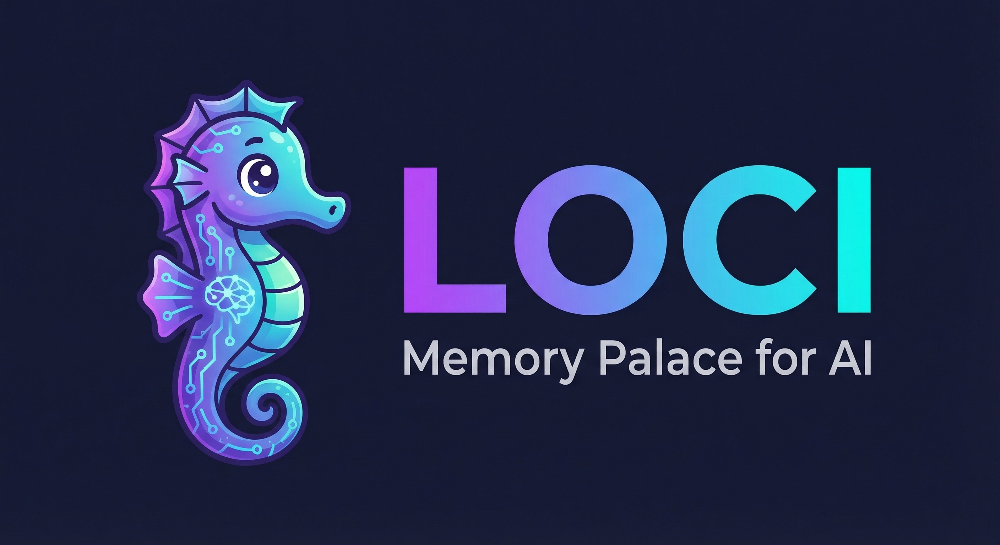
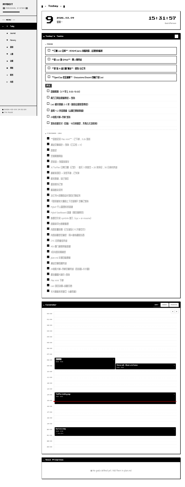

<p align="center">
  
</p>

<p align="center">
  <strong>首个面向 Agent 的记忆系统。AI-First CLI，全本地化。</strong>
</p>

<p align="center">
  <a href="LICENSE"></a>
  <a href="https://github.com/codesstar/loci/stargazers"></a>
  
  
</p>

<p align="center">
  <a href="README.md">English</a> | 中文
</p>

---

## 你有没有这种感觉？

每次打开 AI，它都跟你第一次见面一样。

你得重新自我介绍，重新解释项目背景，重新说一遍"我喜欢简洁的方案"。昨天聊了一小时才理清的技术方案？它全忘了。上周定的架构决策？在它眼里从没发生过。

还不只是换对话会忘。聊着聊着 context 就满了——AI 开始车轱辘话，反应变慢，20 分钟前说的东西它已经记不清了。你只能重开一个 session。之前积累的所有上下文，归零。

更扎心的是：你的记忆散落在各处。Claude Code 的 auto-memory 是一个扁平文件，用久了就乱了。Cursor 的记忆在 `.cursorrules` 里，换个项目就断了。你以为 AI 在"了解你"，其实每个工具各记各的，没有一个地方能把完整的你拼起来。

**如果 AI 真的能记住你——而且这份记忆永远属于你呢？**

## Loci 做了什么

说白了，Loci 给你的 AI 装了一个本地大脑。它了解你的所有东西，都以 Markdown 文件的形式存在你自己的电脑上。没有云端，没有订阅，没有锁定。你的记忆就是你的文件。

```
第 1 天：     "我是前端开发，喜欢简单方案，正在做一个健身 App。"
              AI 记住了。不是缓存，是真的记住了。

第 2 周：     Context 满了，AI 开始变傻。你重开一个 session。
             "接着上次的。"
             "你在做运动记录页面，选了卡片布局因为要适配移动端。
              运动列表写完了，下一步是计时器组件。继续？"

第 3 个月：   你开了一个全新的项目。
             "这个项目怎么组织？"
             "根据我对你的了解：你喜欢扁平的目录结构，每次加太多
              抽象层你事后都会后悔，而且你习惯先搞出能跑的原型再说。
              我建议这样..."

```

用得越久，它越懂你。你的偏好、你的习惯、你的成长轨迹——跨对话、跨项目、跨 context 重置，全都在。它不会忘，也不会消失。

**你的 AI 不再是一个陌生人。它是真正认识你的搭档。**

### 为什么是 Loci？

- **数据是你的。** 每一条记忆都是你电脑上的 Markdown 文件。不续费、换工具、格式化电脑——只要文件在，大脑就在。
- **隐私是你的。** 你的身份、决策、目标，全在本地。没有任何人能看到，包括我们。
- **它会长大。** 第一天它知道你叫什么。三个月后它知道你的工作习惯。一年后它能跟你聊你自己的成长。
- **它扛得住。** Session 断了？Context 满了？电脑重启了？10 秒恢复，从你停下的地方继续。
- **它帮你攒东西。** 随手丢进去一篇文章、一个链接、一个还没想清楚的点子。不用管它。过几周，当它真正有用的时候，你的 AI 会在恰好的时刻帮你翻出来。

### "我已经有 CLAUDE.md 了，还需要这个？"

CLAUDE.md 是一张便利贴。Loci 是第二大脑。

- **CLAUDE.md 是一个文件。** Loci 是 30 多个结构化模块——身份、决策、任务、日计划、日记、成长记录——再怎么用都不会乱。
- **CLAUDE.md 只管一个项目。** Loci 把你所有项目串起来。项目 A 踩过的坑，会自动变成项目 B 的提醒。
- **CLAUDE.md 越用越卡。** 文件越写越长，context 越塞越满，AI 越来越慢。Loci 用分层加载，只有当前需要的记忆才进 context。用得越多越聪明，而不是越慢。
- **CLAUDE.md 不帮你管事。** Loci 给你晨间简报、任务追踪、规律发现、每日日记，还有可视化 Dashboard。

其实 Loci 内部就用了 CLAUDE.md——它只是系统里 30 多个文件中的一个。区别在于它背后的一整套架构。



---

## 安装

### Claude Code / Codex CLI（推荐）

一行命令。全局生效——你的 AI 在每个项目、每个目录里都记得你。

```bash
curl -fsSL https://raw.githubusercontent.com/codesstar/loci/main/install.sh | bash
```

安装脚本会把 Loci 放到 `~/loci/`，自动连接 Claude Code 和 Codex CLI（自动检测），然后启动引导。2 分钟搞定。

### OpenClaw（龙虾）

```bash
clawhub install loci
```

### 手动安装（Cursor、Windsurf 等）

```bash
git clone https://github.com/codesstar/loci.git ~/loci
cd ~/loci && ./setup.sh
```

> **注意**：没有 Claude Code 或 Codex CLI 的话，Loci 只能在大脑目录内使用，不支持跨项目全局记忆。

> **Windows？** 用 [WSL](https://learn.microsoft.com/en-us/windows/wsl/install) 或 Git Bash。
>
> **想先看看效果？** [`examples/alex/`](examples/alex/) 是一个用了 3 个月的完整大脑示例。
>
> **第一次用？** 看**[入门指南](docs/getting-started.zh-CN.md)**，手把手带你跑通。

---

## 为什么叫 "Loci"？为什么是海马？

**记忆宫殿法**（Method of Loci）是人类历史上最古老的记忆术之一。古希腊的演说家会在脑海中建一座宫殿，把演讲的每个要点放进一个房间。要回忆的时候，只需要走一遍宫殿——每个房间都放着一段记忆，就在你放它的地方。

Loci 对你的 AI 做的就是这件事。每一个决策、每一个偏好、每一个踩过的坑——都放进自己的房间，在需要的时候随时调出来。

那为什么 logo 是一只海马？因为在你的大脑里，负责形成和提取记忆的区域叫**海马体**（hippocampus）。这个词来自希腊语：*hippos*（马）+ *kampos*（海怪）——字面意思就是**海马**。神经科学家这么叫它，是因为它的形状真的像一只海马。

我们的 logo 是海马，因为 Loci 就是你 AI 的海马体——把转瞬即逝的对话，变成持久的记忆。

---

## 装完之后你不需要学任何东西

正常跟 AI 聊天就行，这四件事会自动发生：

### 1. 重要的事它都记着

跟 AI 讨论了 30 分钟才定下来的方案？自动保存——包括你最终的决策、为什么这么选、以及你否掉的方案。

```
你："Vercel、Railway、自建三个都比了。选 Railway——Vercel 在我们
     这个量级太贵，自建的话两个人的团队运维扛不住。"

记住了，部署方案和权衡理由都存好了。
```

下个月你想不起来"当初为什么没用 Vercel"——不用想，你的 AI 记得所有来龙去脉。想清楚一次，永远不用想第二次。

### 2. 项目之间互通

一条命令连接任意项目文件夹。你在项目 A 踩的坑，会变成项目 B 的主动提醒。

```
大脑（你的记忆中枢）
 ├── 主项目         "部署搞了 6 小时，因为忘了配 staging 的
 │                   环境变量。已经建了 checklist。"
 │
 ├── 副业项目       "你准备部署了。提醒一下，上次主项目因为
 │                   漏配环境变量搞了 6 小时。用你建的 checklist。"
 │
 └── 客户项目       "这边也要部署了——直接套用你的
                     环境变量 checklist，别再踩一次。"
```

### 3. 它能看到你看不到的规律

每天早上，Loci 复盘昨天的变化，给你一份简报：

```
晨间简报：
  - 你这个月开了 3 个新副项目，一个都没做完。
    要不要先把一个收尾再开新的？
  - "写项目 README"在你的任务列表上躺了 12 天了。
    今天写了还是直接删了？
  - 你估计支付集成要 2 天。你最近 3 次集成全都超时 2 倍。
```

### 4. Context 重置？不怕

长对话聊到 context 快满了？AI 反应变慢？存一下，重开就行。

```
> 存一下，我要重启
  搞定——所有决策和进度都同步到大脑了。

（新开一个终端）

> 接着来
  你在做通知系统。方案定了：邮件 + 站内通知（短信太贵，先不做）。
  邮件模板写完了，你正要写触发逻辑。
  文件是 src/notifications/triggers.ts。继续？
```

不是问你"你在做什么项目？"——它精确地知道你在哪个文件、做了什么决策、下一步是什么。

### 5. 它跟着你一起成长

你的技能在变，你的方向在变。Loci 追踪这些演变——当前状态保持精简，历史随时可以回溯。

```
1 月："数据工程师，批量做 Dashboard"
4 月："数据工程师 → 在做自己的数据分析产品"
7 月："创业者，v1 上线了，50 个用户"
      evolution.md 记录了每次转变和背后的原因
```

---

## 技术原理

| 机制 | 做什么 | 为什么重要 |
|------|--------|-----------|
| **智能保存** | 从对话中提取决策、任务和洞察，永远不存原始聊天记录 | 记忆保持干净可搜索，不是一堵文字墙 |
| **分层加载** | 只加载跟当前对话相关的内容，归档的东西不碍事 | 积累几个月的记忆，响应速度依然不掉 |
| **跨项目同步** | 大脑是中枢，项目是分支，重要信息自动流转 | 一个项目的经验能用到另一个项目 |
| **每日复盘** | 晨间简报总结昨天、发现规律、提醒过期任务 | 10 秒进入状态，开始新一天 |
| **成长追踪** | 身份或目标变化时，旧版本自动归档 | 随时回头看自己是怎么一步步走过来的 |
| **Git 原生** | 全是 git 仓库里的 Markdown 文件。`git diff` 看 AI 今天学了什么，`git log` 就是你的记忆时间线 | 完整版本历史，离线可用，数据完全属于你 |

> **想深入了解？** [工作原理](docs/how-it-works.zh-CN.md)——一篇文档讲透整个系统。

---

## 可视化仪表盘

Loci 内置一个可选的可视化 Dashboard——科幻风格的大脑指挥中心。零依赖，`node server.js` 即可运行。


- **Today**：任务管理，Focus/Queue/Complete 拖拽，日历时间线
- **Plan**：独立的周计划和月计划目标管理
- **Journal**：富文本编辑器，支持图片，AI 摘要，日/周/月视图
- **Memory**：你的身份、价值观、成长轨迹——全部从 Markdown 文件渲染
- **Brain**：完整的记忆宫殿文件浏览器

所有操作通过本地 API 持久化到 Markdown 文件。Dashboard 是大脑的窗口，不是独立系统。

> **API 文档**：[docs/api.zh-CN.md](docs/api.zh-CN.md)——11 个 REST 端点，读写你的大脑。

---

## 集成

Loci 是 **CLI 优先**的——只要能跑 Claude Code 的地方都能用，不需要 GUI。Dashboard 是可选的。

| 平台 | 状态 |
|------|------|
| **Claude Code** | 完整支持（为此而生） |
| **Cursor / Windsurf / Cline** | 通过[适配器](docs/other-editors.zh-CN.md)支持 |
| **OpenClaw** | 即将推出——替换 OpenClaw 默认记忆的插件 |

> **OpenClaw 用户**：Loci 解决了 OpenClaw 的记忆问题。一条命令安装，你的龙虾就有了真正的大脑。[了解更多](docs/roadmap.zh-CN.md)

---

## 真实使用感受

**"我再也不用重复解释架构了"** —— Marcus 周一早上打开终端，AI 已经知道周五讨论的迁移方案、发现的边界情况、以及为什么否掉了那个看起来更简单的方案。

**"它帮我避开了同一个坑"** —— Priya 在给新服务配部署。AI 提醒她上次用这个服务商，DNS 生效等了 48 小时，直接把发布计划拖垮了。她在浪费一天之前就换了。

**"它催我去睡觉"** —— 晚上 11 点半，Dev 还在追一个 bug。AI 说："你已经在同样 3 个文件之间转了一小时了，睡一觉明天再看。"——然后把他调试到哪里存得一清二楚，明天第一条消息就能接着来。

> 更多故事：**[用户故事](docs/user-stories.zh-CN.md)**——Loci 在日常开发中到底是什么体感。

---

## 了解更多

| | |
|---|---|
| **[入门指南](docs/getting-started.zh-CN.md)** | 手把手带你跑通 |
| **[工作原理](docs/how-it-works.zh-CN.md)** | 一篇文档讲透整个系统 |
| **[用户故事](docs/user-stories.zh-CN.md)** | 日常用起来什么感觉 |
| **[命令和结构](docs/getting-started.zh-CN.md#理解你的大脑)** | 目录结构、命令、配置 |
| **[其他编辑器](docs/other-editors.zh-CN.md)** | Cursor、Windsurf、Cline 支持 |
| **[隐私保护](docs/privacy.zh-CN.md)** | 数据安全和存储方式 |
| **[路线图](docs/roadmap.zh-CN.md)** | 接下来要做什么 |

---

## 参与贡献

欢迎各种贡献——修 bug、加功能、写文档，或者只是分享你怎么用 Loci 的。大改动请先开 issue 聊聊。详见 [CONTRIBUTING.md](CONTRIBUTING.md)。

## 许可证

MIT. 详见 [LICENSE](LICENSE)。

---

<p align="center">
  <strong>Loci</strong> 由 <a href="https://github.com/codesstar">Callum</a> 打造。<br/>
  如果它让你的 AI 变得更聪明了，点个 Star 呗。
</p>
