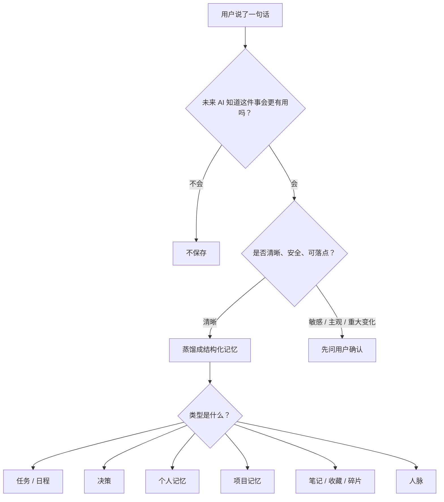

# Loci 项目总览

> 最新更新: 2026-07-07  
> 这份文档是 Loci 当前架构的权威总览。若旧文档里仍出现 P0/P1、someday、周计划/月计划、`references/inbox.md` 等早期概念，以本文为准。

## 一句话

Loci 是一个给 Claude Code 和 Codex 使用的本地 AI 记忆基础设施。它把任务、日程、决策、笔记、项目、人脉、碎片想法和操作记录组织成一个本地大脑，让不同 AI 工具在任意项目里都能读写同一套记忆。

Loci 不保存原始聊天记录。它只保存未来的 AI 如果知道后会明显更有用的内容。

## 现在的定位

Loci 不是一个单纯的 `CLAUDE.md` 模板，也不是普通 todo app。它更像一个本地的 agent memory OS:

- 给 AI 一张清晰的记忆地图: 什么内容该读、去哪读、什么时候读。
- 给 AI 一套可靠的写入规则: 什么值得存、怎么分类、写到哪里。
- 给用户一个可视化控制台: 不需要打开 Markdown 文件也能看任务、日程、笔记、项目和人脉。
- 给 Claude Code 和 Codex 一个共同大脑: 一个工具写入，另一个工具可以继续使用。
- 给项目自己的记忆空间: 项目记忆归项目 repo，大脑只保留索引。

## 北极星原则

### 1. 本地优先

用户数据默认都在本机文件系统里，主要是 Markdown 和 JSON。用户可以查看、备份、迁移、用 Git 管理，也可以彻底删除。

### 2. Loci 汇聚记忆，不占有记忆

个人大脑保存全局记忆、个人信息和项目索引。严肃项目的完整记忆留在项目自己的 repo 里。

```text
个人大脑
├── me/                  个人身份、偏好、经验、成长
├── tasks/               个人任务、日程、每日复盘
├── decisions/           跨项目也有意义的决策
├── projects/index.md    严肃项目索引，只保存指针
├── projects/side.md     项目雏形
├── people/              人脉和关系
├── notes/               用户自己的笔记索引和短笔记
├── references/          第三方材料和收藏
├── inbox.md             随手想法和未整理碎片
└── .loci/activity/      操作总账

项目 repo
└── .loci/
    ├── memory.md        项目活档案
    ├── decisions/       项目决策流水
    └── todo.json        项目开发待办
```

### 3. 记忆像呼吸一样存在

AI 正常回答用户的问题，记忆动作在后面轻量发生。清晰信号自动保存，敏感或重大判断先问一句。确认也要自然，不把用户拖进系统术语里。

## 安装和接入

主入口:

```bash
npx create-loci
```

安装器负责:

1. 创建或选择本地大脑目录。
2. 打开网页向导，收集名字、角色、语言、当前重点等基础信息。
3. 检测 Claude Code 和 Codex。
4. 询问接入 Claude Code、Codex，还是两者都接入。
5. 写入用户级规则块:
   - Claude Code: 用户级 `CLAUDE.md`
   - Codex: 用户级 `AGENTS.md`
6. 让两个工具都知道同一个 brain path。

备选入口:

- `npx create-loci --cli`: 终端向导。
- `curl` / zip 包: 给没有 npm 或网络受限的用户预留。
- 手动安装: `git clone` 后运行 `setup.sh`。

## 启动时 AI 会做什么

Loci 的核心不是每轮都读全部文件，而是分层加载。

```text
L0 Map
  读规则、目录地图、项目索引。知道信息在哪里。

L1 Active Context
  每个新 session 加载少量活跃上下文:
  plan.md、tasks/active.md、inbox.md 最新少量内容。

L2 On Demand
  用户提到相关主题时再读:
  me/、people/、notes/、references/、decisions/、项目 .loci/memory.md。

L3 Archive / Audit
  archive、旧 journal、activity ledger 等只在用户明确问时读取。
```

同一个 session 中，已经读过的 L0/L1 视为缓存，不每轮重复读取。只有文件可能过期、刚刚被写入、上下文被压缩，或用户问“今天 / 最新 / 现在”时，才刷新最小相关文件。

## 对话中 AI 会怎么保存

每轮对话后，AI 做一次轻量信号判断:



手动请求优先级最高。用户明确说“记一下 / save this / remember this”时，只要不危险且能找到合适位置，就应该保存。

## 完整信息架构

### Brain: 本地大脑根目录

Brain 是 Loci 的中心文件夹。它包含用户全局记忆、规则、脚本、Dashboard 和索引。Claude Code 与 Codex 通过用户级 `CLAUDE.md` / `AGENTS.md` 指向同一个 Brain。

关键文件:

| 文件或目录 | 作用 |
|---|---|
| `CLAUDE.md` | Brain 内部规则和目录地图 |
| `AGENTS.md` | 给 Codex 使用的同构规则 |
| `plan.md` | 长期方向、当前目标、阶段重点 |
| `inbox.md` | 随手记和未整理碎片 |
| `.loci/config.yml` | 语言、工作时间、保存模式等设置 |
| `.loci/dashboard/` | 本地可视化控制台 |
| `.loci/activity/YYYY-MM.md` | 操作总账，用来回答“我今天做了啥” |
| `scripts/` | 守卫写入器，避免 AI 手写坏 JSON |
| `templates/` | 全局规则块、项目记忆、决策等模板 |

### Tasks: 任务和日程

Loci 现在是 task-first 模型，不再有 P0/P1/P2、周计划、月计划、someday 这些用户概念。

核心判断:

- Task = 要完成的事。
- Schedule = 占用时间的事。
- 有日期的任务仍然是任务。
- 有具体时间的任务也只留在任务池，不会自动投影到日程；提醒直接读任务池。
- 把任务拉上日程是刻意动作，只在用户确实要把时间占住时做。
- 纯日程不会进入任务池。

数据源:

| 文件 | 作用 |
|---|---|
| `tasks/tasks.json` | 所有真实个人任务的唯一源数据 |
| `tasks/calendar.json` | 日程、时间块（只放占用时间的事，与任务池分离） |
| `tasks/active.md` | 从 `tasks.json` 生成的启动缓存，给 AI 快速读 |
| `tasks/daily/YYYY-MM-DD.md` | 当天背景、状态、复盘，不是任务源 |
| `tasks/journal/` | 更长的每日总结和反思 |

写入必须走守卫路径:

```bash
node scripts/loci-task.js add --title "整理项目文档" --date 2026-06-05
node scripts/loci-task.js schedule --title "开会" --date 2026-06-05 --start 10:00 --end 11:00
node scripts/loci-task.js validate
```

Dashboard 运行时优先走 Dashboard API；否则用 `scripts/loci-task.js`。不要直接手改 `tasks.json` 或 `calendar.json`。

### Journal: 每日总结

Journal 不承担任务数据库职责。它负责“今天发生了什么”和“今天学到了什么”。

当前机制:

- 对话中有重要决策、学习、讨论、进展时，可以往 `tasks/journal/buffer.md` 追加带时间的简短行。
- 用户说“总结今天 / what did I do today / journal”时，AI 读取 buffer、当天上下文和相关项目记忆。
- 生成 `tasks/journal/YYYY-MM-DD.md`，通常包含:
  - Accomplished
  - Learned
  - Discussed
  - Decisions
- 用户确认后写入，并清空 buffer。

Journal 是叙事层，不是任务层。

### Fragments: 碎片、随手记、收藏入口

Fragments 不是一个单独的数据库，而是一组轻量入口，用来处理还没有变成任务、决策或正式笔记的东西。

| 类型 | 保存位置 | 例子 |
|---|---|---|
| 随手记 | `inbox.md` | “突然想到一个宣传句” |
| 收藏夹 | `references/YYYY-MM-DD-slug.md` | 第三方文章、链接、工具、视频 |
| 用户自己的笔记指针 | `notes/index.md` | Obsidian / 飞书 / Notion 文档链接 |
| 用户自己的短笔记 | `notes/<slug>.md` | 临时写下来的短文、脚本、想法 |

判断边界:

- 能执行、有结果 = task。
- 有时间占用 = schedule。
- 已拍板 = decision。
- 用户自己写的内容 = notes。
- 别人的内容或工具链接 = references。
- 还模糊但可能有用 = inbox。

### Notes: 用户自己的笔记

Notes 是用户自己的写作和知识，不是第三方收藏。

两种形态:

1. 外部笔记指针:
   - 写入 `notes/index.md`
   - 只保存标题、链接或本地路径、一句话摘要、标签
   - 正文留在 Obsidian、飞书、Notion 或本地 vault

2. 内联短笔记:
   - 写入 `notes/<slug>.md`
   - 带 frontmatter: `title`、`tags`、`created`
   - 同时在 `notes/index.md` 留一行索引

Notes 默认属于 L2。AI 不在启动时自动加载全部笔记，只在用户问“我关于 X 写过什么”时读索引并按需打开具体文件。

### Memory: 关于用户本人的长期记忆

个人记忆主要在 `me/`。

| 文件 | 作用 |
|---|---|
| `me/identity.md` | 用户是谁、角色、当前阶段 |
| `me/values.md` | 稳定价值观和偏好 |
| `me/learned.md` | 踩过的坑、经验、可复用教训 |
| `me/goals.md` | 更细的目标拆解 |
| `me/insights.md` | 周期性整合出的洞察 |
| `me/evolution.md` | 身份、价值观、目标变化的历史轨迹 |

原则:

- 当前文件保持精简，适合按需读取。
- 变化历史追加到 `evolution.md`。
- 稳定事实可以自动保存。
- 情绪、敏感信息、重大人生方向变化需要先确认。

### People: 人脉和关系

人脉信息写入 `people/`，用于让 AI 记住人是谁、和用户什么关系、上次发生了什么、下次该怎么处理。

建议结构:

```text
people/
├── <person-name>.md       某个人的关系档案
└── meetings/              会议、沟通记录、跟进事项
```

适合保存:

- 合作者、客户、导师、朋友、潜在投资人。
- 用户明确希望 AI 记住的人。
- 后续沟通会明显受影响的关系信息。
- 会议结论和需要跟进的事情。

不适合保存:

- 一次性出现、未来不会再用的人名。
- 敏感关系判断，除非用户明确要求。

### Projects: 项目索引和项目孵化器

`projects/` 是 Brain 里的项目地图，不是项目数据库。

| 文件 | 作用 |
|---|---|
| `projects/index.md` | 严肃项目轻索引，一项一行，指向项目 repo |
| `projects/side.md` | 项目雏形，还没认真做起来的想法 |

边界:

- 严肃项目: 有 repo、有持续投入、有重要决策或里程碑。完整记忆放项目 repo。
- 项目雏形: 像一个项目，但用户还没决定认真做。先放 `projects/side.md`。
- 普通想法: 放 `inbox.md`，不要升成项目。

连接项目时优先使用:

```bash
node scripts/loci-project.js connect --repo <repo-path> --brain <brain-path> --name "<project>" --description "<one-line>"
```

连接后会自动:

1. 创建 `<repo>/.loci/memory.md`
2. 创建 `<repo>/.loci/decisions/`
3. 创建 `<repo>/.loci/todo.json`
4. 注入项目级 `CLAUDE.md` 和 `AGENTS.md`
5. 把 `.loci/` 加进项目 `.gitignore`
6. 在 Brain 的 `projects/index.md` 加索引

### Project Memory: 项目自己的记忆

连接后的项目 repo 里有自己的 `.loci/`。

| 文件 | 作用 |
|---|---|
| `.loci/memory.md` | 项目活档案: 目标、现状、下一步、关键人、进展 |
| `.loci/decisions/` | 项目内部决策流水 |
| `.loci/todo.json` | 项目开发待办 |

项目待办和个人任务必须分开:

- “明天提醒我给客户发材料” = 个人任务，进 Brain 的 `tasks/tasks.json`。
- “给 Loci dashboard 加 notes 页面” = 项目开发待办，进该项目的 `.loci/todo.json`。

项目待办必须走:

```bash
node scripts/loci-projtodo.js add --repo <repo-path> --text "实现设置页"
node scripts/loci-projtodo.js validate --repo <repo-path>
```

### Decisions: 决策

决策分两层:

| 类型 | 保存位置 |
|---|---|
| 用户个人层面、跨项目仍有意义的决策 | Brain `decisions/YYYY-MM-DD-slug.md` |
| 项目内部技术、架构、功能取舍 | 项目 repo `.loci/decisions/YYYY-MM-DD-slug.md` |

判断问题:

> 把这个项目拿走后，这个决策还重要吗？

如果不重要，默认留在项目 repo。项目内部决策不复制进 Brain。只有 `[insight]` 或 `[milestone]` 这种跨项目有价值的摘要，才更新 Brain 的项目索引。

### Activity Ledger: 操作总账

Activity ledger 是审计层，用来回答:

- 我今天做了什么？
- 最近记了哪些事？
- 这周有什么变化？

每次 brain-facing write 之后，都应追加一行到:

```text
.loci/activity/YYYY-MM.md
```

格式:

```text
## 2026-06-05
- 16:20 · 任务 · 记录了整理 Loci 文档
- 16:34 · 项目 · 更新 Loci 项目记忆架构说明
```

它永远不自动加载，只在用户问“今天/这周/最近做了啥”时读取。

## 信息路由总表

| 用户说的内容 | 类型 | 保存位置 | 写入方式 |
|---|---|---|---|
| “这周要整理安装流程” | 个人任务 | `tasks/tasks.json` | `loci-task.js add` / Dashboard API |
| “明天 10 点整理安装流程” | 有时间的个人任务 | `tasks/tasks.json` + `tasks/calendar.json` | `loci-task.js add --date --start --end` |
| “10 点开会” | 纯日程 | `tasks/calendar.json` | `loci-task.js schedule` |
| “今天总结一下” | 每日复盘 | `tasks/journal/YYYY-MM-DD.md` | AI 蒸馏后写入 |
| “突然想到一个宣传句” | 随手记 | `inbox.md` | Markdown 追加 |
| “收藏这个链接” | 外部材料 | `references/YYYY-MM-DD-slug.md` | Markdown + frontmatter |
| “这是我自己的笔记” | 用户笔记 | `notes/index.md` 或 `notes/<slug>.md` | 指针或短笔记 |
| “我喜欢回答短一点” | 偏好 | `me/values.md` 或 `me/identity.md` | Markdown 更新 |
| “我学到不要每次都手改 JSON” | 经验 | `me/learned.md` | Markdown 追加 |
| “这个人是投资人，下次叫他 X” | 人脉 | `people/<name>.md` | Markdown 创建/更新 |
| “我们决定先支持 Claude Code 和 Codex” | 跨项目决策 | `decisions/` | decision 模板 |
| “这个项目数据库选 PostgreSQL” | 项目决策 | `<repo>/.loci/decisions/` | project decision 模板 |
| “给 Loci dashboard 加设置页” | 项目开发待办 | `<repo>/.loci/todo.json` | `loci-projtodo.js add` |
| “帮我记住这个项目” | 连接项目 | Brain `projects/index.md` + repo `.loci/` | `loci-project.js connect` |

## Dashboard

Dashboard 是本地可视化控制台，不是独立数据库。它读取同一套文件，并提供一个安全的 Clean demo 入口用于公开展示。

启动:

```bash
node .loci/dashboard/server.js
```

默认地址:

```text
http://127.0.0.1:8765/
```

路由:

| 路由 | 说明 |
|---|---|
| `/` | Clean dashboard，默认入口，实时读取真实 brain 文件 |
| `/clean` | Clean dashboard 别名 |
| `/api/data` | 本地 brain JSON API |

本地 dashboard 直接读写真实 brain 文件，全新大脑显示干净空态。带测试数据的公开演示托管在官网（`site/demo`），用于截图、演示和 onboarding。

当前页面和数据源:

| 页面 | 数据源 |
|---|---|
| Overview | tasks、projects、notes、decisions、me 的聚合 |
| Tasks / Schedule | `tasks/tasks.json`、`tasks/calendar.json` |
| Journal | `tasks/journal/` |
| Memory | `me/`、`plan.md` |
| People | `people/` |
| Roadmap | 已连接项目的 `.loci/todo.json` |
| Notes | `notes/index.md`、`notes/*.md` |
| Fragments | `inbox.md`、`references/`、notes 指针 |
| Projects | `projects/index.md`、`projects/side.md`、项目 `.loci/memory.md` |

写任务、日程、项目 todo 时，Dashboard 应通过本地 API 或守卫脚本落盘，避免 JSON 损坏。

## Claude Code 和 Codex 如何同步

同步不靠云，也不靠常驻服务。它靠同一个本地 Brain path。

安装后:

- Claude Code 用户级 `CLAUDE.md` 写入 Loci global block。
- Codex 用户级 `AGENTS.md` 写入同样语义的 Loci global block。
- 两个工具启动时都会读同一个 `plan.md`、`tasks/active.md`、`projects/index.md`。
- 两个工具写任务、决策、笔记时都落到同一套文件。

因此:

- Claude Code 写入的任务，Codex 可以读到。
- Codex 连接的项目，Claude Code 下次进项目也能读 `.loci/memory.md`。
- 项目 repo 里的 `CLAUDE.md` 和 `AGENTS.md` 都会注入 project block，保证两个工具一致。

## 当前已经完成的能力

- `npx create-loci` 安装入口。
- Web onboarding 和 CLI onboarding。
- Claude Code / Codex 全局接入。
- 本地 Brain path 跨工具共享。
- L0/L1/L2/L3 分层加载策略。
- Session cache / refresh 策略。
- 信号驱动保存策略。
- Task-first 任务和日程模型。
- `tasks.json` / `calendar.json` 守卫写入器。
- Journal buffer 和每日总结机制。
- Notes: 用户笔记索引 + 内联短笔记。
- Activity ledger: 每次写入后的操作总账。
- Project memory: 项目记忆归项目 repo。
- Project todo: 项目开发待办独立于个人任务。
- Project writer: 一次性连接项目并注入 Claude/Codex 规则。
- Dashboard: tasks、schedule、journal、memory、people、roadmap、notes、fragments、projects 等页面。
- README banner、中文文档、测试报告和多轮安装测试材料。

## 仍需继续打磨

- 清理 Dashboard 设计草稿和测试数据，保留稳定入口。
- 统一旧文档，把早期 P0/P1、someday、旧 planning 文案改成最新模型。
- 完善 people、references、notes 的 README 和示例。
- 让 activity ledger、journal、projects 在 Dashboard 里更清晰。
- 给无 Node 或网络受限用户准备更稳定的 curl / zip 入口。
- 继续优化 Liquid Glass / Clean dashboard 主题。
- 设计 Loci MCP server，把任务、笔记、总账写入变成更可靠的工具调用。
- 后续考虑飞书同步: tasks、calendar、notes、contacts 的映射。

## 测试重点

测试不能只跑脚本，也要验证 AI 对话后的真实落盘。

必须覆盖:

- fresh install: 空目录全新安装。
- Claude Code 写入，Codex 能读取。
- Codex 写入，Claude Code 能读取。
- 无时间任务、有日期任务、有具体时间任务、跨天任务。
- 纯日程不进入任务池。
- Journal 总结和 buffer 清理。
- Notes 指针、内联笔记、references、inbox 的分流。
- People 记忆和后续检索。
- 项目连接、项目决策、项目 todo、项目索引。
- Activity ledger 是否记录每次 brain-facing write。
- Dashboard 增删改任务、日程、项目 todo 后刷新仍持久。
- JSON 不手改，优先走 API 或 guarded writer。

## 相关文档

- [快速上手](getting-started.zh-CN.md)
- [工作原理](how-it-works.zh-CN.md)
- [架构设计](architecture.zh-CN.md)
- [Dashboard](dashboard.zh-CN.md)
- [隐私说明](privacy.zh-CN.md)
- [路线图](roadmap.zh-CN.md)
