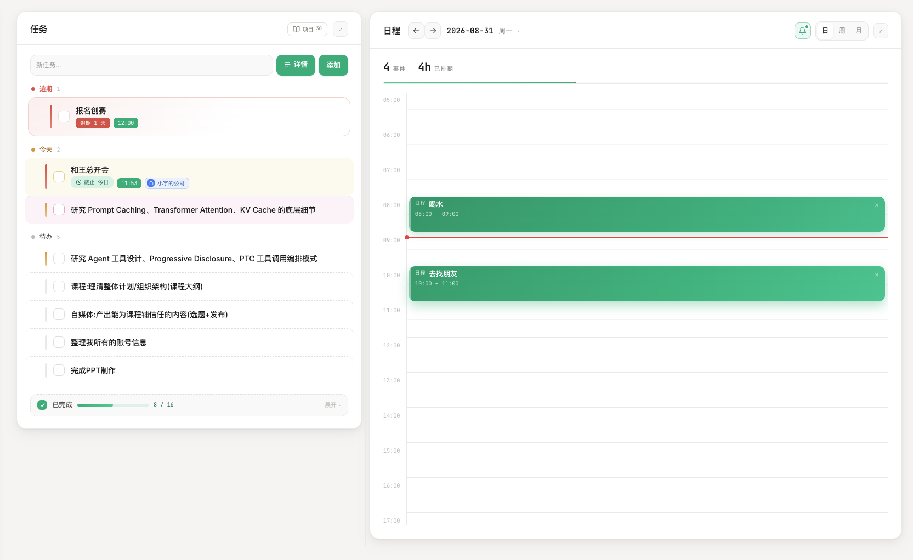
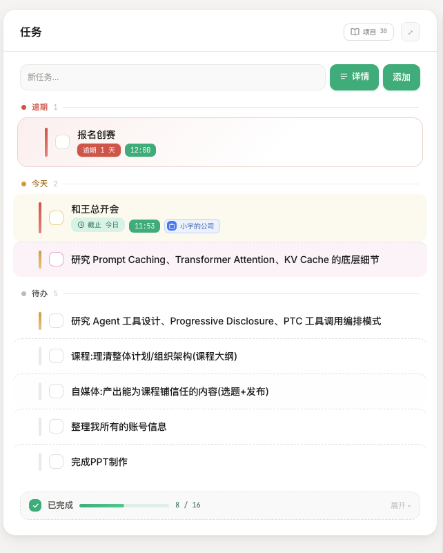
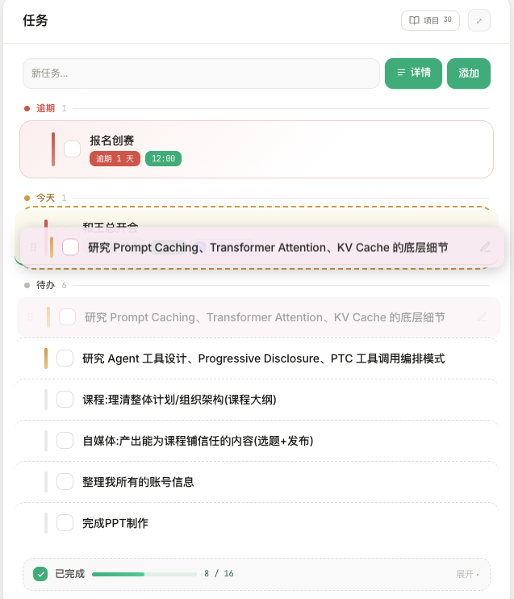
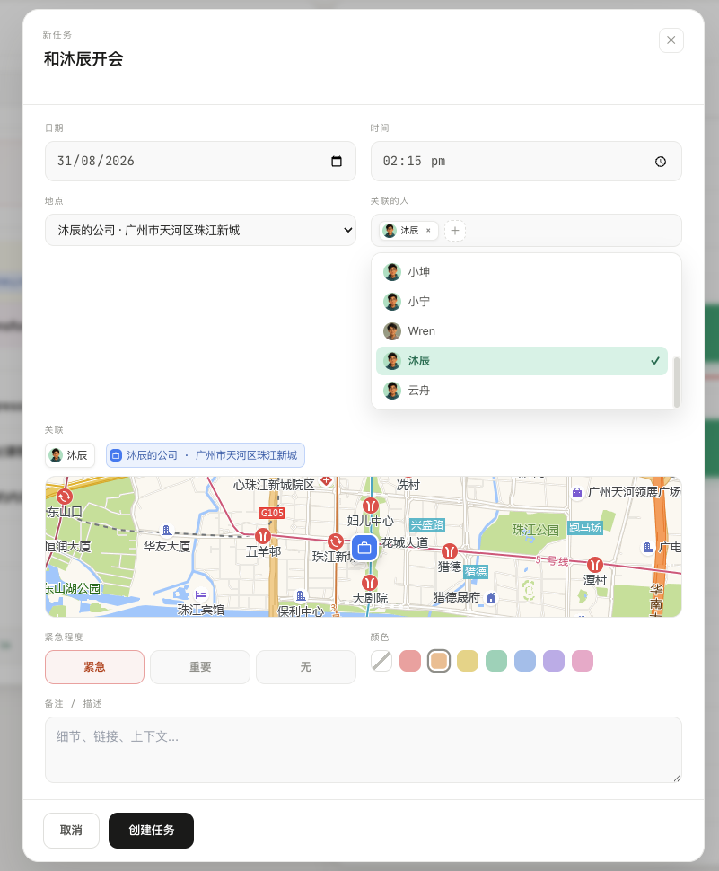
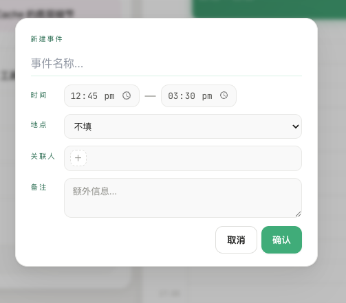
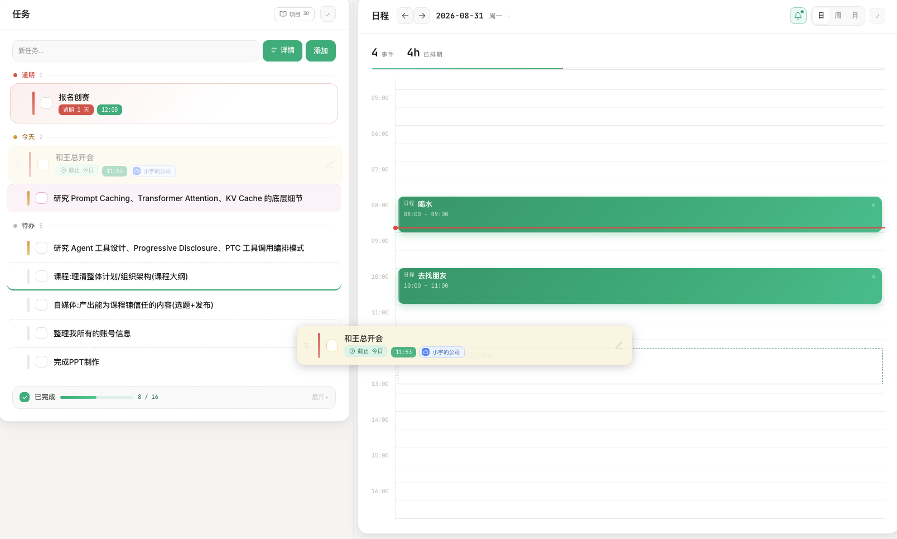
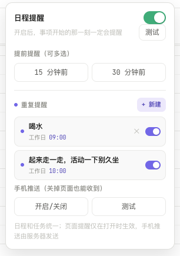

# Loci 使用指南

把记忆留在自己手里，让不同 AI 接着用。

从第一次安装、连接新 Agent，到任务、人脉、知识库的日常用法；也可以继续了解背后的规则、架构和设计取舍。

## 01 · 开始使用：把这段话发给 AI

### 第一次使用 Loci

打开你正在使用的 Claude Code、Codex、WorkBuddy，或具备本地文件与工具能力的 Agent，直接发送：

```text
帮我安装 Loci，并连接到你当前使用的客户端。
请读取并执行：https://raw.githubusercontent.com/codesstar/loci/main/docs/AI-INSTALL.md
已有大脑就复用，保留全部数据，安装后验证连接。
```

AI 会检查环境、找到合适的安装位置、下载程序、连接当前客户端并验证结果。需要安装依赖或授予文件权限时，跟随客户端提示即可。

### 已有 Loci，连接千问、豆包或新的 Agent

直接在**新工具**里发送下面这段话。不用找路径、不用回旧工具问，也不用重新下载大脑。

```text
我已经安装了 Loci，请把你连接到现有大脑。
请读取并执行：https://raw.githubusercontent.com/codesstar/loci/main/docs/AI-CONNECT.md
请你自己找到已有大脑并完成接入，保留数据，不要重复安装。
```

它会查找已有安装记录，识别当前客户端，备份并配置接入口，再读取已有内容进行验证。一个大脑可以连接多个 Agent；新增工具不会自动复制全部聊天记录。

Claude Code、Codex、WorkBuddy 有现成适配器。千问、豆包等客户端由 AI 核实其版本的入口与工具能力；仅能云端聊天或上传附件的版本，无法凭提示词访问本机文件。遇到能力限制，AI 应明确说明，而不是假称接通。

### 连好以后，试着用一次

新开一个对话，发送：

```text
看看我在 Loci 里的待办。
```

已有用户应能看到同一份记录；新用户看到空列表也正常。接下来可以说“明天上午9点提醒我发材料”，再在 Dashboard 或另一个已连接的 Agent 里核对这条任务。

### 打开 Dashboard

```text
帮我打开 Loci Dashboard，使用我现有的大脑。
如果服务还没运行，请启动并打开页面。
```

Dashboard 是在本机运行的面板，服务运行时才能访问。这里可以直接查看和修改 AI 保存的数据。提醒还需要调度服务、设备通知权限与实际送达。

### 更新 Loci

```text
帮我按官方指南升级现有 Loci：
https://raw.githubusercontent.com/codesstar/loci/main/docs/AI-INSTALL.md
先备份，保留我的数据和自定义规则，升级后验证并说明结果。
```

升级与“连接新工具”是两件事。升级会更新程序和托管规则；连接新工具通常只增加入口。换电脑时也要先迁移或恢复数据，再连接新电脑上的 Agent。

## 02 · Loci 是什么，解决什么问题

**Loci 是跨 Agent 的本地记忆与数据层。** 它把偏好、任务、日程、人物、资料和项目上下文放在用户能查看、修改、备份的文件里，让接入同一大脑的 Agent 使用同一份已保存的信息。

最直观的例子是：在一个 Agent 里说“以后用中文简短回复”，它将偏好写入大脑。另一个正确接入的 Agent 启动时读到同一偏好，就有条件继续按这个习惯回应。这里共享的是文件里的状态，不是两个工具的全部聊天记录。

Loci 关注三件事：重要内容有没有记住不确定、不同工具之间记忆不通、用户难以统一看清与控制。它提供一个由用户掌握的共同数据层，让已有信息可以在不同工具之间接续。

| 对比 | 没有接入 Loci | 正确接入 Loci 后 |
| --- | --- | --- |
| 记忆放在哪里 | 取决于各工具自身机制，也可能只是当前上下文 | 约定在共同大脑及项目仓库中持久保存 |
| 换 Agent | 新工具未必能拿到上一个工具的已知信息 | 可以按规则读取共同文件中已经沉淀的信息 |
| 用户能否检查 | 取决于宿主提供的入口 | 能直接读文件，也能在 Dashboard 看和改 |
| 读写规则 | 各工具自行决定或用户分别配置 | 使用统一短入口与完整操作手册 |
| 是否保证永不忘记 | 不保证 | 仍不保证；需要内容已保存、可访问且实际被读取 |

Loci 不会修改模型权重，也没有给模型增加一种生物式记忆。它增加的是**模型外部的持久状态、访问约定和操作工具**。模型真正受某条记录影响，发生在这条记录被放进当前上下文之后。

为什么还做 Dashboard？因为记忆如果只会保存，用户仍很难判断它有没有用、有没有记错。任务、日历、人脉和知识库把已保存的信息放回日常工作里：看安排、找资料、回忆关系、接续项目。Dashboard 也是人工纠错和检查 AI 操作的窗口。

## 03 · 整体架构：规则、工具、数据各管什么

直接查看：[LOCI.md 原文与解释](#locimd入口到底写了什么) · [启动地图的作用与输出](#启动地图实际会注入哪段文字) · [完整规则11个分块](#loci-rulesmd11个分块具体管什么) · [启动还是每轮 Hook](#启动-hook还是每轮-hook)


### 维护两份规则，而不是维护几套大脑

| 层次 | 文件或模块 | 负责什么 | 不负责什么 |
| --- | --- | --- | --- |
| 短入口 | `LOCI.md` | 大脑在哪、怎么拿短偏好、什么时候读手册 | 不塞入各模块全部操作细节 |
| 完整操作手册 | `LOCI-RULES.md` | 记录判断、内容路由、工具使用、关联、日志、撤销 | 不存用户实际任务和人物正文 |
| 启动读取器 | `scripts/loci-context.js` | 从当前大脑读取短偏好，返回位置和指针 | 不另维护一份静态启动地图，不负责自动总结对话 |
| 执行工具 | `scripts/`、Dashboard API | 校验参数、读写文件、维护部分关联与活动记录 | 不自动知道用户真正想表达什么 |
| 本地数据 | Markdown、JSON、附件 | 保存跨会话状态 | 不会因为落盘就自动进入所有模型上下文 |
| 人的界面 | Dashboard | 浏览、手动操作、检查数据 | 不需要另一套与 Agent 分离的数据副本 |
| 面向人的说明 | `docs/` | 安装、使用、架构、验证说明 | 不是运行时隐含的第三份业务规则 |

安装时，`LOCI.md` 的内容会被替换为实际大脑路径，再合并进宿主指令文件的 Loci 标记区。以后产品规则主要维护入口和手册；改脚本行为才需要改执行代码。

这里解释当前架构中模型会看到的三类内容。**需要维护的是两份规则文件；启动地图是程序现场生成的一段文本，不是第三份规则文件。** 用户的偏好和实际记录则保存在大脑数据中。

> **入口 → 会话信息 → 操作手册。** `LOCI.md` 告诉 Agent：有 Loci，大脑在哪、先获取什么、何时查手册。启动地图提供这次会话应先知道的短偏好、生成时间和位置。`LOCI-RULES.md` 说明具体信息怎样读取、保存和更新。实际任务、人物和笔记另存在数据文件里，相关时再读。

| 内容 | 它回答什么问题 | 内容来自哪里 | 何时读到 |
| --- | --- | --- | --- |
| `LOCI.md` 短入口 | 大脑在哪里？先做什么？何时查手册？ | 产品维护的短规则，安装时替换路径后写入宿主入口 | 宿主加载原生指令时 |
| 启动地图 | 此刻路径、时间、用户短偏好是什么？ | `loci-context.js` 读取实际偏好，结合运行时路径生成 | 有效 Hook 注入，或 Agent 按入口调用同一脚本 |
| `LOCI-RULES.md` 完整手册 | 这类内容应该怎么读、怎么保存、怎么确认？ | 产品维护的一份业务规则文件 | 首次涉及 Loci 操作时完整读取；有效且未变时复用 |

### LOCI.md：入口到底写了什么

下面是当前短入口原文。`<brain-path>` 是模板占位符，安装或连接时替换成用户实际的大脑绝对路径，不要求用户自己猜目录。

```markdown
<!-- loci:start v2 -->
## Loci 共享大脑

- 大脑根目录：`<brain-path>`。完整操作手册：`<brain-path>/LOCI-RULES.md`。
- 首次回复前获取短偏好：已有有效的 `[Loci] Lightweight startup map` 就复用；否则调用 `<brain-path>/scripts/loci-context.js`，以大脑绝对路径作为参数（Node.js 执行，路径与用户文本安全传参）。失败时仅读取 `<brain-path>/me/preferences.md` 一次。偏好立即用于当前回复。
- **首次涉及记忆、任务、日程、人物、碎片、笔记、项目记录或回顾时，先完整读取操作手册，再读写相关数据。** 普通对话中发现值得保存的明确任务、决定、稳定偏好或资料，也触发这一步；不必等用户说“记住”。无相关信号不读手册、不保存。
- 手册已完整存在于当前上下文且未变时复用；读取被截断就补齐。规则更新或上下文压缩后缺失时重新读取。同一会话不逐条消息重读。
- 启动不加载任务、计划、人物、笔记、日记和项目正文。相关时查索引，再读最小数据；要求最新信息时刷新对应来源。
- 手册相对路径以大脑根目录解析；索引或工具返回的绝对路径原样使用。项目数据属于对应项目仓库。
- 明确不保存的内容不保存；敏感、含糊或重大个人变化先确认。规则或大脑无法访问时暂停依赖它们的写入，说明限制；不能假称已读取或保存。
<!-- loci:end -->
```

逐条看，这段入口做了七件事：

1. **告诉位置。** 给出大脑根目录和完整操作手册的路径。
2. **先拿偏好。** 已有有效地图就复用；否则运行读取器。失败只尝试读一次偏好文件，偏好用于当前回复。
3. **定义触发条件。** 任务、人物、资料等操作要先读完整手册；普通对话中产生明确可保存内容，也触发读取，不必等“记住”。
4. **避免反复读。** 已完整存在于上下文的规则可复用；截断补齐，更新或压缩后缺失则重读。
5. **限制数据范围。** 启动不预读整个人脉库或全部任务；当前问题需要时，查相关索引和最小记录。
6. **统一路径解释。** 相对路径以大脑为根，绝对路径不重复拼接，项目记录去项目自己的仓库。
7. **规定基本边界。** 尊重“不记”；敏感、含糊、重大变化先确认；读不到规则或大脑时不冒充保存成功。

所以 `LOCI.md` 不是各模块完整使用说明。它先让 Agent 找到正确入口，再明确何时必须去看详细规则。

### 启动地图：实际会注入哪段文字

#### 作用：让 Agent 开始时就知道少量重要信息

启动地图给 Agent 一份**本次会话的简短说明**：用户希望怎样协作、现在生成这段信息的时间、大脑和操作手册在哪里。这样，第一句回复就能照顾用户的语言、称呼和工作习惯，后续也有查找记忆的入口。

它不只有偏好。**当前代码已经输出：短偏好、生成时的本地日期与时间、大脑路径、当前工作目录、入口与手册指针，以及避免重复加载的提示。** 用户习惯只要已写入 `me/preferences.md` 的短偏好范围，就能一并带入；读取器不会自己分析聊天、推测用户性格或总结全部历史。

这里的“动态”指**运行读取器时，从当前文件和运行环境现场取值**。注入后，它就是上下文中的一份快照。上午9点生成的时间，到下午仍写着9点；偏好文件后来被另一位 Agent 修改，旧会话中的文本也不会自动变化。涉及“现在、今天、最新”的问题，要重新获取当前时间或读取最小的相关来源，不能把启动快照当成实时状态。

#### 可以再加入什么，哪些还没有实现

第二层可以承载会影响当前协作的少量信息。应先判断：**它是否经常影响回答、来源是否明确、是否足够短、过期后怎么办。** 重要不等于要把全部记录都放进来。

| 信息 | 例子 | 当前状态与放置方式 |
| --- | --- | --- |
| 沟通偏好与稳定工作习惯 | 中文短答、先给结论、专注工作时少打断 | 已支持从 `me/preferences.md` 读取；只在短偏好预算内输出 |
| 时间与运行位置 | 生成时的日期、时间，大脑与工作目录 | 已输出；时间来自运行读取器的环境，当前没有单独的时区字段 |
| 当前协作中需要关注的状态 | “今天只安排线上活动”“本周先完成一个项目” | 可扩展，当前不会自动读取；若加入，应从有来源、更新时间和有效期的短状态记录获取 |
| 用户明确希望被提醒的行为约定 | “规划时保留连续的专注时间” | 长期且常用的可写入偏好；临时约定应带期限，不把模型猜测固化为用户习惯 |
| 具体任务、日程、人物与历史 | 今天全部待办、所有会议、某人的完整往来 | 当前按需读取；需要安排今天时再查任务与日程，无需每个会话都带入 |

**“可以扩展”不代表当前已经实现。** 增加临时状态等字段，需要修改读取器与刷新逻辑；把一句话写进说明文档，不会让 Hook 自动获得这项能力。数据仍保存在自己的来源文件里，Hook 与无 Hook 的路径继续调用同一个读取器。

#### 当前实际输出

以下由当前 `loci-context.js` 在临时目录中真实运行生成，偏好为虚构示例，输出路径替换为 `/example/loci` 与 `/example/work`。没有读取任何人的真实资料；不要把示例路径用于实际连接。

```text
[Loci] Lightweight startup map · 2026-10-08 09:00 Thu
Brain: /example/loci
Workspace: /example/work
This startup map is already loaded. Do not run it again in this session.

===== Standing user preferences — honor in every reply =====
# 沟通偏好

- 默认用中文，先给结论。
- 称呼我为小林。

Loci entry: /example/loci/LOCI.md
Operation manual (first Loci use): /example/loci/LOCI-RULES.md

Do not preload plans, tasks, inbox, journals, project memory, or history. Read the smallest relevant source on demand and cache it for this session.
===== end of lightweight startup map =====
```

| 输出字段 | 意思与目的 |
| --- | --- |
| `[Loci] Lightweight startup map` 与时间 | 标识这是读取器的启动输出；时间是生成时的本地时间，不会在对话过程中自行刷新 |
| `Brain` | 本次连接的大脑位置，后续从这里定位规则和数据 |
| `Workspace` | 当前工作目录，提供运行环境位置；不代表项目正文已读入，也不代表这个目录自动成为大脑 |
| `already loaded` | 提醒 Agent 本会话不要又跑一遍读取器，避免 Hook 和后备调用重复 |
| `Standing user preferences` | 来自 `me/preferences.md` 的短偏好；示例中的语言和称呼是动态用户数据 |
| `Loci entry` | 短入口文件的指针，不是在地图里再复制入口全文 |
| `Operation manual` | 完整手册的指针，不代表此时已读过手册正文 |
| 结尾的按需读取提示 | 限定启动范围，防止拿到路径后继续预加载全部任务和历史 |

偏好文件仍是模板或为空时，不输出偏好区块。当前偏好输出最多30行、2,000字节；地图总预算4,400字节，超限有提示。它是短偏好的摘取，不是语义总结，也不是全量用户画像。

**Hook 和没有 Hook 的区别在递送方式。** 前者由宿主在事件触发时把脚本输出放入上下文；后者由 Agent 依照入口执行同一脚本，输出作为工具结果进入上下文。两者读取同一份文件，无需同步两份偏好。

地图结尾与入口都有“不要预加载/重复读取”的短提醒，用来约束这段输出的使用范围；任务分类、人物关系等业务细节不在地图里另写一份。修改长期业务规则主要去手册，修改用户偏好去 `me/preferences.md`。

### LOCI-RULES.md：11个分块具体管什么

这是 **Agent 使用 Loci 的完整操作手册**：记什么、不记什么、去哪里查、怎样写、怎样关联、如何确认与撤销，都在这里。它覆盖任务、日程、人物、碎片、笔记、个人记忆和项目记录；Dashboard 是查看和修改同一份数据的界面。Agent 通常通过文件工具、脚本或本地 API 操作，因此这里的规则范围比 Dashboard 的按钮操作更大。

手册当前是规则版本6，按以下11块维护。表格是面向人的讲解；Agent 真正操作时读取大脑中的 [完整手册原文](https://github.com/codesstar/loci/blob/main/LOCI-RULES.md)。

| 分块 | 具体规则 | 解决的典型问题 |
| --- | --- | --- |
| 01 读取与路径 | 相对/绝对路径、先索引后正文、缓存刷新、日期时区、引用内容作为资料处理 | 防止拼错路径、拿旧记录回答“最新”、将外部文字误当指令 |
| 02 保存判断 | 明确持久信号才保存；提炼事实、查重、保留来源；敏感或含糊信息先确认 | 防止什么都记、重复新增、把随口想法写成已定决定 |
| 03 任务与日程 | 完成事项与占用时间分开；通过任务工具/API 写入；更新按 ID；碎片/人物/地点保留引用 | “9点发材料”不会自动变成日历时间块；保存不等于提醒送达 |
| 04 碎片、链接与收藏 | 使用同一个碎片工具；用户说明放标注；复用标签；不再向旧 inbox 追加 | 防止收藏散在不同入口、模型猜测冒充用户标注 |
| 05 笔记与研究 | 外部正文留原处、脑中留指针；短笔记、个人研究、项目研究各有位置 | 防止把整篇研究当成碎片或决定，避免强行复制用户笔记库 |
| 06 人物、关系、互动与地点 | 按真实 name 查重；双方人物存在后再连边；互动追加、更新保留原字段 | 防止只写“是朋友”却没有图谱边，或更新时抹掉旧互动 |
| 07 个人记忆与决定 | 偏好、身份、价值观、状态、反思、经验分开；重要变化记录旧值、新值与理由 | 防止一次情绪被固化为长期价值观，兼顾当前状态与变化记录 |
| 08 项目记忆与开发待办 | 项目状态、资料、进展、决定、待办与研究留在项目仓库；大脑只留索引 | 防止项目全文挤进个人大脑、开发 todo 混入个人任务池 |
| 09 日记、回顾、整理与时间关怀 | 按相关时间窗口回顾；整理只按请求或实际启用触发器；关怀服从配置 | 防止启动全库扫描、无依据生成洞见，或反复催促用户 |
| 10 保存结果、活动记录与撤销 | 按实际结果确认；活动日志记一次；撤销先核对后续改动 | 防止失败也说成功、重复记账、撤销覆盖别人后来的修改 |
| 11 工具与扩展 | 使用现有工具与 API；参数查帮助/实现；扩展优先复用模板；文件修改核对新状态 | 防止编造命令参数、把未运行的服务当作可用能力 |

例如用户说“把这篇链接保存下来，标注下周写稿参考”：入口触发读手册；手册告诉 Agent 使用碎片工具、把用户原话放进标注、查重并核对结果；链接的实际内容、标签和记录 ID 在数据和工具结果里，不预写在规则中。

### 三者怎样配合，谁应该改哪里

| 想改变什么 | 应改哪里 |
| --- | --- |
| “以后叫我小林，用中文短答” | 个人数据 `me/preferences.md`；下次读取器自然读到新值 |
| “什么场景需要先读手册” | 产品入口 `LOCI.md`；之后通过安装/刷新传播到各宿主入口 |
| “碎片、人物、任务应该怎样操作” | `LOCI-RULES.md` 对应分块；需要代码支持时同步改工具 |
| “新增或更新一条真实任务” | 由工具修改任务数据，不修改这两份规则 |
| “启动地图要增加一个动态字段” | 读取器代码；先评估是否值得让每个会话承担读取成本 |

普通问题通常只需要入口与短偏好；首次记忆操作再加完整手册；处理具体对象时再读相关数据。**文件被读取，只说明内容进入上下文；执行是否正确，仍要看工具和文件的实际结果。**

源码依据：[短入口](https://github.com/codesstar/loci/blob/main/LOCI.md)、[启动读取器](https://github.com/codesstar/loci/blob/main/scripts/loci-context.js)、[完整规则](https://github.com/codesstar/loci/blob/main/LOCI-RULES.md)。本文示例是说明快照，运行时始终以这些源文件为准。

### 从一次请求看执行顺序

以“明天上午9点提醒我发材料”为例：

1. 宿主在会话开始时加载自己的原生指令入口；Loci 短入口随之进入上下文。
2. 有有效 Hook 输出就使用；没有则让 Agent 按入口调用 `loci-context.js`。两种方式读取同一份偏好文件。
3. 请求涉及任务。若操作手册尚未完整存在于上下文，Agent 先读 `LOCI-RULES.md`。
4. 核对日期、时区和意图。发材料是要完成的事，即使带时间也仍是任务。
5. 调用 `loci-task.js add` 或对应本地 API。工具返回实际保存的记录，相关路径维护生成视图及日志。
6. Agent 按结果简短确认；Dashboard 读取同一任务池，能显示这条任务。
7. 到点提醒由实际运行的调度与通知通道处理。第5步成功不等于第7步已经送达。

### 哪些东西会进入上下文

| 内容 | 由谁提供 | 时机 | 是否每条消息重复 |
| --- | --- | --- | --- |
| 短入口规则 | 宿主读取原生指令文件 | 会话建立及宿主定义的加载时机 | 由宿主管理，不让 Agent 每条消息重复读取 |
| 时间、短偏好、大脑和手册指针 | Hook 或 Agent 调用同一读取器 | 会话启动；已有有效输出则复用 | 不重复启动读取 |
| 完整操作手册 | Agent 文件读取工具 | 首次涉及 Loci 读写，或发现明确可保存信号时 | 已完整读取且有效时复用 |
| 任务、人脉、笔记、项目等实际数据 | Agent 文件或命令工具 | 当前问题需要时 | 只刷新最小相关来源 |
| 工具执行结果 | 脚本/API 返回 | 每次实际操作之后 | 本次结果用于本次确认 |
| 活动账本 | 按需读取 | 用户询问做过什么、需要回顾时 | 不在启动时全量加载 |

“注入”只是把文本放进模型当前上下文的不同途径：原生指令、Hook 附加上下文、工具读取结果都能做到。它们并不会把规则固化进模型内部。

### 没有 Hook 怎么办

Hook 是一个宿主事件触发的程序入口。它能让偏好在启动时更直接地被提供；没有 Hook 时，短入口要求 Agent 调用相同读取器。**两条路线同源，只有送达方式不同。**

短入口也不是强制执行器：宿主可能没加载它，模型可能忽略它，工具也可能没有权限。因此验收要覆盖“配置写对 → 新会话实际收到 → 真实操作正确”三个层次。Hook 主要加强第二层，不能代替第三层。

### 启动 Hook，还是每轮 Hook

**Loci 当前采用启动注入，加上相关时按需刷新。** 稳定偏好适合在会话开始时提供，当前时间与易变数据则在实际需要时重新取值。这样能兼顾第一句回复的个性化和后续信息的新鲜度。

先区分触发时机。以 Claude Code 为例，`SessionStart` 在会话开始、恢复等生命周期事件触发；`UserPromptSubmit` 在一轮输入交给模型处理前触发；`Stop` 在模型完成回复时触发。若想让补充信息影响本轮回答，应在处理输入前提供。一次输入可能带来多次工具调用和模型生成，不能把“每轮输入前”理解成“每生成一句话前”。具体事件由宿主及版本决定。[Claude Code Hook 文档](https://code.claude.com/docs/en/hooks#hook-lifecycle)

| 方式 | 适合提供什么 | 代价与边界 |
| --- | --- | --- |
| 启动 Hook | 短偏好、大脑位置、规则指针、启动时刻 | 调用频率低；会话很长或外部文件有变更时，快照可能过期 |
| 每轮输入前 Hook | 更新后的时间、已变更的偏好、已过期状态的更正 | 可以更及时，但每轮有执行成本；整份重复注入会增加上下文负担，运行慢也会延迟回答 |
| Agent 按需读取 | 排日程时取当前时间，问今天时查当天数据，提到某人时读对应档案 | 读取范围小；依赖 Agent 识别触发条件并正确执行 |

启动注入的内容只要还在有效上下文中，后续轮次就可以继续使用，并非只影响第一条回复。上下文被压缩或重置后，仍需要恢复关键内容。

当前仓库的 Claude 接入配置了 `startup|resume|clear|compact|fork`，Codex 接入配置了 `startup|clear|compact`；这些是安装器写入的匹配条件，实际触发以宿主支持为准。因此，“启动 Hook”也可能在清空或压缩后再次提供地图。**当前 Loci 没有安装用于逐轮注入地图的 `UserPromptSubmit` Hook。** 写文件后的活动记录 Hook 另有用途，不等于逐轮更新上下文。

如果以后确实需要更强的实时感，建议在现有启动方案上增加一个很轻的每轮检查，而不是每轮重新载入整份地图或完整手册：

1. **只补变化。** 偏好未变就不重复输出；发生变更时，提供新的短值并注明替代旧值。临时状态到期时也要明确失效，不能只停止输出、让旧状态继续留在上下文里。
2. **时间单独处理。** 对时间敏感的请求获取当前时间和明确时区；若产品选择每轮提供时间，只加一行即可。宿主已经提供可靠时间时避免重复。
3. **保持轻量。** 做文件变更或有效期检查，不在每轮扫描全部历史、调用模型总结用户、或远程检索。对读取耗时和输出长度设上限，失败不阻塞普通聊天。
4. **所有 Agent 共用来源。** 有相应 Hook 的宿主自动补充；其他宿主保留入口指引和按需读取。不要为每个 Agent 维护一份不同的用户状态。

以上是后续扩展建议，本次说明没有启用逐轮 Hook。当前选择是：**入口保持短，启动先带上必要信息，首次操作读规则，易变数据用到再刷新。**

源码依据：[启动读取器](https://github.com/codesstar/loci/blob/main/scripts/loci-context.js)、[Claude Hook 配置](https://github.com/codesstar/loci/blob/main/scripts/loci-claude-settings.js)、[Codex Hook 配置](https://github.com/codesstar/loci/blob/main/scripts/loci-codex-hook.js)。宿主事件语义参考 [SessionStart](https://code.claude.com/docs/en/hooks#sessionstart) 与 [UserPromptSubmit](https://code.claude.com/docs/en/hooks#userpromptsubmit)。

### 数据具体放在哪里

```text
brain/
├── LOCI.md                 短入口
├── LOCI-RULES.md           完整操作手册
├── me/                    偏好、身份、价值观、反思等
├── tasks/                 tasks.json / calendar.json / recurring.json
├── people/                人物档案与关系边
├── places/                地点记录
├── notes/                 笔记、外部笔记指针和挂载配置
├── references/            碎片与收藏附件
├── projects/index.md      认真投入项目的索引
├── decisions/             个人决定
├── .loci/activity/         活动账本
├── .loci/dashboard/        本地面板及 API
└── scripts/               受约束的操作工具

project-repo/.loci/
├── memory.md              当前状态、Now / Next
├── profile.md             稳定项目资料
├── progress/              进展流水
├── decisions/             项目决定
├── todo.json              项目开发待办
└── knowledge/             项目研究、方案和资料
```

依据：[短入口](https://github.com/codesstar/loci/blob/main/LOCI.md)、[完整手册](https://github.com/codesstar/loci/blob/main/LOCI-RULES.md)、[启动读取器](https://github.com/codesstar/loci/blob/main/scripts/loci-context.js)、[Dashboard 共享入口](https://github.com/codesstar/loci/blob/main/.loci/dashboard/lib/chat/context.js)。

## 04 · 记什么、不记什么，详细规则放哪里

规则集中在 `LOCI-RULES.md` 的11个分块中：读取与路径、保存判断、任务与日程、碎片、笔记、人物与地点、个人记忆、项目、回顾、保存后处理、工具与扩展。

| 用户表达 | 处理方向 | 主要保存位置 |
| --- | --- | --- |
| “以后用中文，回复短一点” | 明确稳定偏好，当次回复就应用 | `me/preferences.md` |
| “明天9点发材料” | 带时间的任务 | `tasks/tasks.json` |
| “明天15点开会，45分钟” | 占用时间的日程 | `tasks/calendar.json` |
| “这个链接留着，之后写稿参考” | 碎片，用户理由作为标注 | `references/` |
| “写一篇关于这次调研的完整笔记” | 长篇笔记或项目研究 | `notes/` 或项目 `.loci/knowledge/` |
| “小林是小周介绍认识的” | 人物记录加关系边 | `people/` 与 `.connections.json` |
| “这个项目决定先用文件存储” | 项目内部技术决定 | 项目 `.loci/decisions/` |
| 一般闲聊，没有持久信号 | 不保存 | 无 |
| 敏感、含糊、临时情绪、重大个人方向 | 先确认，不擅自固化 | 确认后按内容路由 |

统一原则是**先服务当前请求，再判断是否有持久价值**。保存时提炼必要事实，不保存整段聊天；明确说“不记”就不记。撤销尽量恢复本会话最近一次保存，涉及多文件或期间已有修改时不能盲目回滚。

旧版 auto/manual 分支已经移除。留下的是同一套判断：明确持久信号可自然沉淀，敏感与不确定内容先确认。删除模式选项不等于无条件保存一切。

### 手册一次读完，为什么数据仍然按需

规则告诉 Agent 怎么操作，数据告诉它这一次要操作什么。一本相对稳定的规则手册读一次后复用；日记、联系人正文、项目历史则会不断增长，不能每次启动都装进去。

当前规则中，短入口约 **1.5 KB**，完整手册约 **14.9 KB、162行**；这些是 UTF-8 文件大小与行数，不是 token 数。不同模型的切词、宿主注入及工具截断策略不同，不能只凭字节数保证“绝不会截断”或“没有污染”。

启动读取器另有 **4,400字节输出预算**；偏好部分有30行、2,000字节限制。超限会提示按需读取剩余偏好。这是短偏好输出的预算，不是完整手册的预算。

需要手册时必须完整读取；工具输出被截断要补齐。上下文压缩后规则丢失、手册版本变化时重新读取。“本会话读过”不意味着后续永远有效。

“索引常在、内容按需”在当前架构中的准确含义是：**入口、路径和读取方法保持可发现，相关时再查模块索引和正文。** 它不等于启动时常驻所有项目、笔记、联系人索引；当前入口明确不预加载这些数据。

## 05 · 为什么这样设计：已经做过的取舍

| 决策 | 得到什么 | 付出什么、还需注意什么 |
| --- | --- | --- |
| 本地 Markdown、JSON 和附件 | 可查看、可改、可迁移，安装不需要独立数据库 | 跨设备同步、并发冲突和复杂检索需要额外处理 |
| 跨 Agent 共用文件 | 数据不绑定单个客户端，复用已有工具生态 | 无法完全控制外部 Agent 的加载、推理和权限流程 |
| 短入口 + 一本完整手册 | 规则集中，安装块短，维护边界易解释 | 第一次 Loci 操作会多一次完整读取 |
| 首次使用才读手册 | 普通无记忆请求不承担全部规则开销 | 依赖模型识别触发场景，存在漏读风险 |
| 一次读完整手册，不拆六份指南 | 避免路由选择和多文件漂移，便于维护 | 简单任务也会读到其他模块规则，需要控制手册规模 |
| Hook 可选、读取同源 | 有 Hook 时增强偏好送达，无 Hook 仍能接入 | 后备调用仍依赖模型；不能夸大为等价的执行保证 |
| 任务与日程分开 | 完成事项与时间占用各有意义，日历不被待办挤满 | 必须做好自然语言分类和主动拖入日程的关联 |
| 碎片统一写入 | 文本、链接、图片、文件共用收集入口 | 类型增多后，抓取失败、富化状态和搜索需一致处理 |
| AI 建议与用户标注分开 | 不把推测写成用户原话，便于追溯和纠错 | 元数据更多，需要解释“建议标签”与已采纳标签 |
| 项目正文跟仓库走 | 项目边界清楚，大脑轻量，恢复工作更直接 | 索引路径可能失效，需要检查仓库位置和权限 |
| 笔记聚合，正文可留原处 | 复用用户现有 Obsidian 或文件夹工作流 | 路径、移动、访问权限以及外部链接失效要处理 |
| 暂不做 MCP、数据库和新模式框架 | 保持本地工具链简单，降低部署与维护成本 | 标准化工具发现、结构化调用与权限控制仍有提升空间 |

### 为什么之前会复杂

旧版每层都有合理的初衷：全局块负责跨项目发现大脑，启动地图把关键偏好主动送到模型，详细 `CLAUDE.md` 与 `docs/behavior.md` 负责业务规则。问题发生在职责漂移后：几个地方都开始写“记什么、往哪里写、什么时候读”，再加上聊天引擎的提示词，形成重复甚至矛盾。

当前架构让每层各司其职：入口定位；读取器提供当前短偏好；手册维护业务规则；工具执行；数据落盘。`docs/behavior.md` 的有效规则被迁移，旧重复文档退役；`docs/` 回到面向人的说明。

### 一层、两层、MCP，为什么暂时这样选

把详细规则全塞进全局 MD，能减少一次手册读取，但所有普通请求都会带着它，升级也要复制更多内容到各入口。把规则拆成很多按需小指南，单次内容更少，却增加选路和维护成本。当前两份文件的选择，是在**有限维护时间、跨客户端接入、首次延迟与规则一致性**之间取一个明确边界。

MCP 可以提供工具发现和结构化调用，但不会自动解决“该记什么、何时检索、是否得到用户授权”。它可以是以后工具适配方式之一，不是当前文件方案天然无效的证明。当前核心不要求增加这层服务。

依据：[0.6.0 架构说明](https://github.com/codesstar/loci/blob/main/docs/architecture.md)、[重构 PR #9](https://github.com/codesstar/loci/pull/9)。

## 06 · 任务与日历：完成一件事，还是占用一段时间

### 设计理念

左边处理“我有什么要做”，右边处理“我的时间被什么占用”。这是语义区分，不只是把同一份列表换两个视图。任务可以有截止日或提醒时间，却不一定有确定时长；会议、预约、出行则明确占用时间。

任务按逾期、今天、待办、已完成等状态组织。“今天”帮助聚焦，待办承接尚未安排的事，已完成折叠以减少干扰。日历用于看冲突与时间安排，不负责把所有待办自动铺满。



以下使用 Loci 系列文章里的界面配图，点击可看大图。图片保留当时的界面，具体操作与边界以本页说明为准。

### 在 Dashboard 中操作

#### 管好待办，再安排今天

在任务侧输入标题；需要更多信息时打开详情，补日期、时间、紧急程度、颜色，以及人物、地点或碎片关联。将待办拖到“今天”，表示今天计划处理；完成后勾选。修改事项时更新原记录，避免重复添加。







#### 给事情留一段时间

会议、预约或明确的时间块，从日程侧创建，填写开始和结束时间。确实要为一条任务留时间时，也可以将它拖入日程再调整时段；这个动作是在安排时间，不代表任务已经完成。





#### 到点提醒，或设置重复提醒

右上角的提醒设置用于查看通知权限和周期规则。手机推送还依赖安全访问地址、订阅权限，以及电脑和相关服务保持运行。下图展示文章中的一次实际通知；你的设备是否送达，需要实际验证。




### 用 AI 怎么操作

```text
明天上午9点提醒我发材料。这是一条待办，不要占用日历时间。
```

预期：任务池出现一条带日期和9点时间的任务；不凭空增加一个1小时日程。

```text
明天下午3点到3点45分，和小林在星河咖啡讨论原型。
请安排到日程；如果人物或地点已有记录就关联，没找到就告诉我。
```

预期：新增日程，时间与关联核对清楚。不会仅因为提到人名就替用户补出一份未经确认的人物档案。

```text
把“发材料”那条待办改到后天上午10点，更新原任务，不要重复新增。
```

```text
每个工作日10点提醒我起来走一走。
保存后告诉我提醒规则是什么，以及通知通道是否已经准备好。
```

### 底层与边界

任务在 `tasks/tasks.json`，日程在 `tasks/calendar.json`，周期提醒在 `tasks/recurring.json`。通过 Dashboard API 或 `loci-task.js` 操作；`tasks/active.md` 是生成视图，日记也不是任务源。

日期与时区必须结合当前时间判断。用户说“下周”“明早”且含义影响结果时应澄清。数据已保存、调度服务已运行、设备已收到通知，是三个不同状态。

来源：[任务工具](https://github.com/codesstar/loci/blob/main/scripts/loci-task.js)、[提醒调度](https://github.com/codesstar/loci/blob/main/.loci/dashboard/lib/reminders.js)。

## 07 · 人脉与地点：记住人，也记住关系的来由

### 为什么是卡片、关系图和地图

见过很多人，过几天却忘了对方是谁。单纯通讯录只保存联系方式，不能很好回答“谁介绍的、上次聊了什么、这次为什么要找他”。

卡片与标签适合找人；人物详情承接职业、介绍来源和互动；关系图表达联系人之间的边；地图把人和常去地点放入空间。几种视图服务不同问题，不是为了给同一份资料多套装饰。

### 在 Dashboard 中操作

在人物页浏览或搜索卡片，用标签缩小范围，打开详情看信息与互动。关系图用来理解介绍链和共同联系人；地图用于查看已有地点并跳转导航。地点详情和导航链接是否可用，取决于地址与坐标信息是否完整。

```text
帮我记住小林：做产品设计，在深圳，今天在产品交流会上认识。
是已经在通讯录里的小周介绍我们认识的。
先检查有没有重复人物；建立两个人之间的关系，并写清介绍来源。
```

预期：人物档案存在，关系两端使用真实 `name`，关系图中有边；不能只是把“小周介绍”写进正文却不维护图谱。

```text
今天和小林聊了可穿戴设备，他正在验证老年人的使用场景。
把这次交流补进他的互动记录，保留以前的记录。
```

```text
下周去深圳前，帮我找出我记录过的当地产品设计方向联系人，
按已有资料列出上次互动；没有记录的部分不要猜。
```

### 地点怎么和任务连接

人物存于 `people/`，地点存于 `places/`，人物关系放在 `people/.connections.json` 的 `edges` 数组。任务与日程保存人物、地点引用；工具会尝试匹配已有记录并返回匹配结果。地点关联让“见谁、在哪里、准备什么”能连起来。

敏感的住址、联系方式和未经确认的人物评价不能因为“人脉管理”就无条件自动保存。导航链接不等于已经接通车机，也不等于 AI 已替用户发送消息。

来源：[当前人物与地点操作规则](https://github.com/codesstar/loci/blob/main/LOCI-RULES.md)。

## 08 · 知识库：笔记、碎片和任务怎样连起来

### 设计理念：不只收藏，还要找得回、用得上

知识收集常见的问题是：素材散在各个平台，用户只记得“看过”，却找不到“在哪里、为什么存”。因此收集时除了内容本身，还需要时间、来源、标签和用户自己的标注。

这里有两种内容：**笔记是要阅读、编辑和组织的完整文档；碎片是随手收集的链接、想法、截图、文件或引用。** 长篇研究不能因为来自 AI 就当作碎片；它应该进入笔记或项目知识目录。

当前碎片已经并入知识库，不再作为独立侧栏页面。收集墙让图片、链接、文字有不同的可见形态；点开进入细节，搜索和标签帮助重新找到它。

### 在 Dashboard 中收藏

1. 在知识库的收集框输入文字、粘贴链接或图片，或拖入附件。
2. 一条收藏可以包含多个内容块，配一份共同标注。标注写“我为什么要留它”，不要和原文混成一段。
3. 输入 `#` 查看已有标签，优先复用已有名字；保存后打开详情补充或修改。
4. 按文字、来源、标注、标签等搜索。AI 建议标签与用户标签分开，建议可选择采纳。
5. 资料确实要推动行动时，将它关联到一个任务。任务指向资料，资料仍然留在知识库。

### 碎片：让 AI 操作

```text
收藏这个链接：https://github.com/codesstar/loci
我的标注是“写作前回看跨 Agent 记忆架构”，标签用已有的“写作”。
```

```text
找出我以前存过的关于 AI 记忆的资料，
把来源、保存时的标注和可打开的链接列出来，不要只给我泛泛总结。
```

```text
给“准备产品分享”这条已有任务关联刚找到的那条资料。
保留资料原件，不复制一份，也不要把资料直接改成任务。
```

所有新碎片通过 `loci-scrap.js` 写入 `references/`，附件保存在其管理的文件目录。旧 `inbox.md` 条目保持兼容，编辑时由现有逻辑迁移；不再向 `inbox.md` 添加新碎片。

链接标题、封面抓取和 AI 富化可以失败。当前富化流程调用本机可用的 Claude CLI；模型不可用时，基本保存仍有价值，但不能声称已经生成摘要或图片描述。AI 的 `ai_tags`、`summary`、`caption` 与用户原话分开，Agent 不手填这些字段冒充用户意见。

### 笔记：文件留在原处，阅读集中到这里

“我的笔记”承接本地笔记；“链接文件夹”可把已有 Markdown 目录或 Obsidian 库聚合进来；飞书、Notion 等网页笔记保存指针，正文仍在原应用。

手动操作以链接文件夹、粘贴外部链接、浏览目录和阅读为主。当前笔记阅读区强调展示正文；编辑可让 Agent 修改原文件，或回原编辑器完成。

```text
把我指定的 Obsidian 文件夹接入 Loci 知识库，正文保留原位置。
先确认目录能访问，再登记来源；不要复制整个库进大脑。
```

```text
写一篇《第二大脑的三个原则》，放进我的 Loci 笔记目录并更新索引。
之后把第二条改成“先记录来源，再提炼结论”，只修改对应段落。
```

```text
找到我上次写的产品访谈笔记，先打开原文，
再提炼三条已经有证据支持的需求；不要把你的推测写成用户反馈。
```

`notes/.sources.json` 保存外部文件夹挂载；`notes/index.md` 保存单篇指针。挂载目录读取有数量与深度限制，适合轻量聚合，不能承诺无限规模的完整检索。当前源码仍保留部分笔记写入 API；“当前阅读界面不做重编辑器”不等于后端完全只读，这个边界后续应进一步收敛。

来源：[碎片实现](https://github.com/codesstar/loci/blob/main/.loci/dashboard/lib/scraps.js)、[任务引用碎片的改动](https://github.com/codesstar/loci/commit/4ed4064)、[笔记与来源处理](https://github.com/codesstar/loci/blob/main/.loci/dashboard/server.js)。

## 09 · 个人档案与记忆：当前的你，和变化的你

### 为什么分偏好、身份、价值观和反思

“怎么和我说话”和“我是谁”是两类信息；今天的一次情绪也不应立刻成为长期价值观。个人档案要让用户能看清 AI 到底依据了什么，并把当前状态与变化历史分开。

| 信息 | 位置 | 维护方式 |
| --- | --- | --- |
| 语言、称呼、语气、协作习惯 | `me/preferences.md` | 保持短，立即影响当前回应 |
| 稳定身份事实 | `me/identity.md` | 更新当前事实，不堆整段聊天 |
| 稳定原则和价值观 | `me/values.md` | 不把新念头过早固化 |
| 健康、精力与状态管理 | `me/wellbeing.md` | 敏感信息先确认 |
| 近期反思 | `me/insights.md` | 带背景和观察状态 |
| 可复用经验 | `me/learned.md` | 提炼可影响后续行动的经验 |
| 重要变化历史 | `me/evolution.md` | 更新当前文件后，追加旧值、新值和理由 |
| 长期方向 | `plan.md` | 与项目里的技术决定分开 |

### 怎么使用

在个人档案/记忆页查看身份、价值观与成长内容，发现错误就修正对应事实。稳定沟通偏好可以直接说；重大人生变化或敏感信息应明确是否保存。

```text
以后回复先给结论，尽量简短。请记为沟通偏好，并从这条回复开始应用。
```

```text
刚才那段只是临时想法，不要写进长期偏好或价值观。
```

```text
列出你在 Loci 里保存的关于我工作方式的事实，给出来源。
其中“每天晚上工作”已经不准确，请只改这项，保留其他记录。
```

个人档案越多，不等于每次都更懂你。真正有用的是信息准确、能及时更新、相关时才读取。将短偏好常驻，是因为语言和称呼会影响几乎每次回应；将长篇反思按需读取，是因为它们只对部分问题有用。

## 10 · 项目页面：让项目自己保存上下文

### 设计理念：大脑聚合，项目拥有

项目的进展、技术选择和开发待办会随着仓库变化。把这些内容全部复制到个人大脑，会制造两个版本、失效路径和过大的启动上下文。Loci 让正文留在项目仓库，大脑只维护项目索引。

当前项目页聚合已连接项目的资料、进展、决定、待办和文件入口。

### 查看项目与使用 AI

人在项目页选择项目，查看当前状态、最近进展、开发待办与知识文件。项目 todo 的完成状态应写回项目自己的 `.loci/todo.json`；它不是一份独立的个人任务副本。

```text
记住当前这个项目。先确认仓库路径，再连接到我的现有 Loci 大脑。
目标是月底交付原型；当前已经完成交互稿；下一步是实现登录。
```

```text
这个项目决定先用文件存储，因为现在是单用户原型。
记录背景、候选方案、决定和后续检查条件；这条决定留在项目仓库。
```

```text
给当前项目增加开发待办“补登录错误提示”，放到项目待办里。
然后更新当前进展：登录主流程已经跑通。
```

用户明确要求连接即可执行；未经要求但持续投入的项目，可以在自然时机提议一次。随口想到的潜在项目不必立刻创建整套仓库记忆。

`memory.md` 是恢复当前现场的短摘要，`profile.md` 是稳定资料，`progress/` 是进展流水，`decisions/` 是真实取舍，`knowledge/` 是研究和材料。研究不是决定：调研过某方案，不等于已经选择它。

依据：[项目连接工具](https://github.com/codesstar/loci/blob/main/scripts/loci-project.js)、[项目待办工具](https://github.com/codesstar/loci/blob/main/scripts/loci-projtodo.js)、[项目记忆模板](https://github.com/codesstar/loci/blob/main/templates/project-memory.md)。

## 11 · 总览、日记、大脑记录与其他入口

### 总览：重新进入自己的工作现场

总览用来降低“打开后不知道看哪里”的成本，聚合已有数据的重点和入口。它不应成为新的数据源，也不应该为了制造充实感自动编造今日重点。

手动打开总览后，从需要的模块进入。用 AI 时可以这样问：

```text
根据已保存的任务和日程，告诉我今天最需要关注的三件事。
先核对当前日期和最新记录，不要自动替我重新安排。
```

### 日记与大脑记录：总结建立在操作证据上

任务回答“要做什么”，日记回答“怎么理解这一天”，活动账本回答“系统何时保存或修改了什么”。将三者分开，可以避免把一条保存操作误当成用户现实中已完成的工作。

在日记页切换日期、查看活动与终端会话线索，阅读或编辑当日记录。已保存的会话统计是辅助线索，不代表读取了所有工作内容，更不能把会话数量直接等同于产出。

```text
回顾今天在 Loci 中有记录的活动，按时间列出发生了什么。
区分“新增待办”“实际完成”和“只是讨论”，没有证据的部分不要补。
```

```text
根据今天已有的任务结果、活动和日记线索，写一份简短复盘：
做了什么、遇到什么问题、明天最重要的一步。
```

活动账本在 `.loci/activity/YYYY-MM.md`；日记在 `tasks/journal/`。账本按需读取，不在启动时全部加载。当前版本不因开始聊天就自动扫描全部历史、强行整理或生成洞见；自动化只有实际启用并运行时才能这样描述。

### Dashboard 里的聊天入口

内置聊天面板调用本机可用的 Claude/Codex CLI 引擎，并使用共同的 Loci 入口。用户仍需可用的客户端、登录或模型配置；Dashboard 本身不是另一个免费模型服务。

它与“在外部 Agent 里用 Loci”共用数据，但执行环境不同。内置 Claude 引擎有进程复用与预热；Codex 引擎按已有 CLI 会话方式调用。外部客户端的启动、权限提示、模型速度不由 Loci 全面控制。

### Skills、设置及界面数量

当前导航还包含技能等辅助入口；设置处理语言、模型/聊天、提醒等实际可用配置。技能与 Loci 记忆分工不同：技能提供某类任务的做法，Loci 提供持久数据和使用约定。Loci 不因列出技能就自动保证其安装、权限和第三方服务可用。

当前导航可见总览、任务/日程、人脉、个人档案、项目、知识库、技能和日记。

依据：[当前 Dashboard 界面与导航](https://github.com/codesstar/loci/blob/main/.loci/dashboard/index.html)、[Claude 引擎](https://github.com/codesstar/loci/blob/main/.loci/dashboard/lib/chat/engine-claude.js)、[Codex 引擎](https://github.com/codesstar/loci/blob/main/.loci/dashboard/lib/chat/engine-codex.js)。

## 12 · 开发中遇到的问题、真实反馈与解决状态

以下记录来自公开问题与代码改进。每项列明现象、处理和仍待解决的部分，状态变化以关联 Issue 为准。

### 12.1 Codex 一句话等几分钟：重复读取与调用往返

公开 Issue #6 记录了微信群用户报告：每轮先读启动文件，耗时5—15分钟，并伴随工具连接异常，用户因此卸载。这是反馈记录中的现象，不代表所有环境的普遍耗时。

旧路径逐个读取多个文件，还可能每条消息重读、失败后重试。后续改为一条命令输出启动内容、每会话一次、失败不反复重试、Hook 已提供则不重复加载。0.6.0 进一步将启动限制为短偏好，把详细手册推迟到首次记忆操作。

**解决到哪：** 文件和流程已经简化，相关测试已存在；真实外部 Agent 的端到端耗时仍需要对应入口测量。规则少了，不代表推理、网络和工具启动时间都消失了。

来源：[Issue #6](https://github.com/codesstar/loci/issues/6)、[一次调用替代逐文件读取](https://github.com/codesstar/loci/commit/50f1def)、[避免重复启动](https://github.com/codesstar/loci/commit/d7f6367)。

### 12.2 Windows 无限刷新：读取与监听形成循环

Issue #3 报告 Dashboard 不断刷新、连接堆积。文件监听把系统自己的写入和部分重复事件也当成外部变化，刷新又引发下一次变化，形成循环。

已实现的处理包括：忽略噪声路径，短时间抑制自身写入事件，比较文件大小与修改时间，对通知防抖并设置冷却窗口；前端使用较温和的数据更新路径。后续性能改动还减少了 GET 请求的写副作用。

**解决到哪：** Issue 已关闭，相关代码可查。迁移到不同文件系统、同步盘或杀毒环境后仍应复测，不能只测 macOS 就推断 Windows。

来源：[Issue #3](https://github.com/codesstar/loci/issues/3)、[监听修复提交](https://github.com/codesstar/loci/commit/75fa796)、[服务端缓存与 GET 清理](https://github.com/codesstar/loci/commit/52aeadb)。

### 12.3 Git Bash 与 Windows Node 路径不一致

Git Bash 的 `/d/...` 或虚拟路径，未必能被原生 Windows Node 当作有效路径。错误的大脑指针一旦被登记，后续 Hook 和工具会继续找错目录。

已有修复是在将路径交给原生 Node 前完成原生路径转换，验证和备份已有指针，并在三平台 CI 中加入带空格、中文、特殊字符和 Windows 盘符的隔离测试。0.6.0 重构时包装脚本的 Windows 检查曾失败，修正后才重新通过。

教训是：跨平台不是“Shell 语法差不多”；必须在进程边界验证传给目标运行时的实际路径。

来源：[Windows 路径修复](https://github.com/codesstar/loci/commit/1be7bfc)、[0.6.0 验证范围](https://github.com/codesstar/loci/blob/main/docs/validation-0.6.md)。

### 12.4 笔记明明有52条，页面却显示0条

Issue #7 报告 Windows 盘符开头的外部笔记路径被静默跳过。报告者定位到外部指针的正则判断没有包含盘符，并报告本地补上后52条可见。

**待处理：** 公开源码仍保留不包含盘符的判断，该 Issue 仍开放。报告者的本地修复尚不能代表发布版本已解决。

建议下一步：集中处理 POSIX、Windows 盘符和 UNC 等路径形式；为现有索引格式补回归测试；识别失败要给出提示，不要静默显示为空。

来源：[Issue #7](https://github.com/codesstar/loci/issues/7)、[指针解析源码](https://github.com/codesstar/loci/blob/main/.loci/dashboard/server.js#L1052)。

### 12.5 人物页白屏：Markdown 元数据的类型不是总能猜对

历史提交修复过 frontmatter 自动类型转换造成的界面崩溃，并将 `photo` 等字段加入不自动强转的名单。灵活文件格式降低录入门槛，却会让同一字段出现字符串、数字或空值等形态。

已有处理是收紧字段转换并增强前端兼容。后续应把字段约束集中到读写边界，让错误数据更容易定位，避免只在每个页面追加容错。

来源：[类型转换与人物页修复](https://github.com/codesstar/loci/commit/284b320)、[photo 字段处理](https://github.com/codesstar/loci/commit/9fb47a7)。

### 12.6 AI 和页面同时改任务：丢更新风险

多入口共用文件带来并发写问题。历史改动加入受保护的读取—修改—写入与原子写，避免两个更新在常见写入路径上互相覆盖；还把人物、地点匹配放进本地工具，减少模型重复读取整个人脉库。

这类保护只覆盖经过相应工具的操作。一个拥有文件写权限的外部 Agent 仍可能绕过工具直接改 JSON，文件锁也不等于跨设备协同冲突解决。

来源：[原子更新](https://github.com/codesstar/loci/commit/4d11c49)、[本地人物地点匹配](https://github.com/codesstar/loci/commit/3f2afff)。

### 12.7 已保存，却没收到提醒

提醒需要从记录、调度、推送、浏览器权限一直走到设备展示。历史上已有 Apple 推送对 VAPID subject 的兼容问题、重复推送与订阅清理等修复。用户电脑休眠、服务未运行、通知权限或网络也会影响送达。

处理方法不是重复保存任务，而是逐段诊断：记录时间是否正确、调度是否运行、推送请求是否成功、设备是否实际展示。最终应以用户设备的到达为验收，而不是日志中出现“pushed”。

来源：[Apple 推送修复](https://github.com/codesstar/loci/commit/51f910f)、[稳定性与推送去重](https://github.com/codesstar/loci/commit/e3c1f1f)。通知是否送达，以实际设备收到为准。

### 12.8 其他反馈与进展

| 已找到的公开反馈 | 当前能确认的状态 | 应采取的处理 |
| --- | --- | --- |
| 每个 Agent 都要安装一遍吗 | 维护者已回复无需重装；当前同一大脑可多入口接入 | 安装说明明确“一份大脑，多次连接” |
| OpenCode、Hermes 能否接入 | 有公开接入诉求；不等于现成适配已全部验收 | 逐客户端核对原生入口与工具能力 |
| Pi 被识别成 Codex | Issue #8 仍开放；只有现象，不足以确定根因 | 补客户端版本、路径和安装输出，再复现 |
| DSH 插件冲突 | 反馈帖有报告与维护者跟进，没有完整解决证据 | 先明确工具、插件组合、复现条件 |
| 删除没反应 | 反馈帖有现象和截图，未找到完整关闭证据 | 明确页面、对象、版本及 API 返回，补最小复现 |
| 两台电脑，希望云同步 | 用户提出需求，维护者表示寻找简单方案 | 明确备份与双向同步区别，先解决冲突策略 |

来源：[反馈帖及评论](https://github.com/codesstar/loci/issues/5)、[OpenCode #4](https://github.com/codesstar/loci/issues/4)、[Hermes #2](https://github.com/codesstar/loci/issues/2)、[Pi #8](https://github.com/codesstar/loci/issues/8)。这些是定性反馈，不能据此推导用户总数、留存率或需求占比。

### 12.9 验证覆盖到哪里

0.6.0 有9个测试文件，在 Linux、macOS、Windows CI 上运行，覆盖短上下文、Hook 合并、安装升级、重复安装、数据保护、回滚、活动与碎片/任务引用等。

隔离 Codex 探针在一次任务请求中先读取入口和完整手册，再真实写入正确日期与时间的任务，没有误生成日程；它也额外读取了活动账本，因此不是最少调用数的证明。本地 qwen3.5:4b 的合成工具探针跳过手册、猜错参数，未通过。

单次成功不是可靠率统计，不同环境也不能用来给模型排名。已发布测试不代表所有原生客户端版本、上下文压缩恢复和设备提醒都已验收。

来源：[公开验证记录](https://github.com/codesstar/loci/blob/main/docs/validation-0.6.md)、[发布 CI](https://github.com/codesstar/loci/actions/runs/37725538952)。

## 13 · 待优化清单，以及哪些事暂时不做

### 优先级按用户损失和验收成本排列

| 优先级 | 改进项 | 为什么值得做 | 完成标准 |
| --- | --- | --- | --- |
| 高 | Windows 笔记指针识别 | 已有明确、可复现的数据不可见问题 | 盘符/UNC/POSIX 及失效路径测试；页面不静默丢条目 |
| 高 | 客户端接入诊断 | “装了但没生效”会直接伤害信任 | 分别展示入口存在、实际送达、工具操作三层结果 |
| 高 | 删除无响应的最小复现 | 用户已经报告操作无反馈 | 定位对象与失败位置，错误可见，失败时不假成功 |
| 高 | 原生端到端延迟测量 | 用户慢的是整轮交互，不是单次磁盘写入 | 记录提交、首字、首工具、落盘、确认及重复调用数 |
| 中 | 大脑与文档中的版本边界 | 旧文章和旧模块说明仍可能指向过时入口 | 安装、页面、规则、已知问题引用一致，过时内容有标识 |
| 中 | 规则遵守与压缩恢复评测 | 大上下文不保证模型遵守 | 多客户端、长会话、重复读取、漏读与敏感保存测试集 |
| 中 | 提醒可观测性 | 保存和送达之间缺少直观状态 | 可区分已保存、调度、发送失败、设备验收 |
| 中 | 笔记读写边界与大库检索 | 读界面、旧编辑 API、挂载上限存在历史包袱 | 明确权限与路径策略，达到上限有提示，索引可刷新 |
| 待探索 | 跨设备同步 | 有真实需求，但文件冲突不是复制目录就能解决 | 先定义单写者/冲突副本/恢复，再验证双设备离线修改 |

### 为什么优先改善这些问题

“装了但没生效”“明明保存却看不到”“服务运行却没收到提醒”都会直接影响日常使用。后续改进应让这些状态可见、可复现、可恢复。

性能优化需要看整轮请求：模型初始化、推理、工具往返、文件操作和确认输出。当前已减少重复读取，内置聊天也使用部分进程复用和缓存；复杂检索、长会话恢复和不同宿主的实际耗时仍需持续验证。

这些方向不代表已经实现或承诺具体交付时间。进展以 [公开 Issues](https://github.com/codesstar/loci/issues) 和 [更新记录](https://github.com/codesstar/loci/blob/main/CHANGELOG.md) 为准。

## 14 · 常见问题

### 换一个 AI，会记得我吗

已经保存进 Loci、并被新 Agent 正确读取的信息可以继续使用。没有保存的聊天内容、其他工具内部的记忆不会自动搬过来。

### 为什么有时记住了，有时没有

Loci 不记录所有对话。明确任务、稳定偏好和希望保留的材料可以沉淀；普通闲聊、含糊想法和临时情绪不应直接固化。希望保存时直接说“记住”或“收藏”，不希望保存时说“这条不要记”。

### 写错了可以改吗

可以在 Dashboard 修改，或者让 AI 找到原记录后更新。近期保存也可以说“撤销刚才那次保存”；有后续修改时，AI 应先核对，避免误覆盖。

### 新 Agent 找不到我的记录怎么办

把安装章节的“连接新的 Agent”指令发给它，让它自动检查已有安装记录、目录权限与客户端入口。不要重新创建大脑；相同内容在另一工具里能读到时，通常应先检查连接。

### 所有 AI 都能接入吗

需要客户端能够接收持久指令、访问本地文件并执行所需工具。现成适配与需核实的客户端在安装章节列明。只有当前对话读到规则，不代表下次对话也会自动加载。

### 数据都存在本机吗

记忆文件默认保存在本机，使用 Markdown、JSON 和附件。所用 Agent 可能调用云模型，链接抓取、地图和推送也可能联网。可以管理本地记录，但模型服务的数据处理仍取决于你的配置。

### 要付费吗

Loci 使用 MIT 开源许可。你选择的模型、Agent 或第三方服务可能另外收费。

### 为什么保存了提醒，却没有收到通知

保存成功、调度运行、设备收到通知是不同环节。让 AI 检查提醒时间、服务状态和通知通道，并以设备实际收到作为送达依据。

### 可以跨电脑同步吗

可以备份和迁移文件，但自动、可靠的多设备双向同步尚待完善。两台电脑分别修改同一份文件时可能冲突，不建议把简单复制当作完整同步方案。

### 必须一直打开 Dashboard 吗

Agent 可以通过本地脚本读写大脑，不要求你一直看着面板。Dashboard 浏览、部分 API 与提醒功能需要相应服务保持运行；具体取决于所用功能。

## 15 · 反馈与参与

### 遇到问题

在 [GitHub Issues](https://github.com/codesstar/loci/issues) 描述发生了什么：使用的系统与 Agent、做了什么操作、期望结果和实际结果。附上可复现步骤与经过隐私处理的报错，通常比“用不了”更容易定位。

可以先让 AI 帮你整理，不需要自己搜日志或找目录：

```text
帮我检查刚才 Loci 操作失败的原因，整理一份问题报告。
写清环境、复现步骤、预期与实际结果，去除私人路径、个人记录和凭据。
先给我看，不要自动对外发送。
```

### 了解实现

- [代码仓库](https://github.com/codesstar/loci)
- [架构与设计取舍](https://github.com/codesstar/loci/blob/main/docs/architecture.md)
- [短入口、启动地图与操作规则](https://github.com/codesstar/loci/blob/main/docs/context-explained.md)
- [给 AI 的安装指南](https://github.com/codesstar/loci/blob/main/docs/AI-INSTALL.md)
- [给 AI 的连接指南](https://github.com/codesstar/loci/blob/main/docs/AI-CONNECT.md)
- [验证记录](https://github.com/codesstar/loci/blob/main/docs/validation-0.6.md)
- [开源许可](https://github.com/codesstar/loci/blob/main/LICENSE)

欢迎提交问题、改进文档或贡献代码。说明当前行为、给出复现与验证结果，可以让改进更容易被理解和维护。
