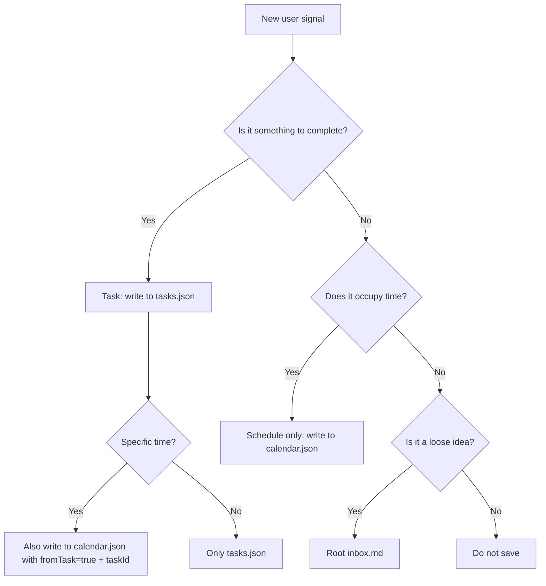

# tasks/ — Tasks And Schedule

Loci uses one simple model:

> A task is something to complete. A schedule item is time that is occupied.

Do not expose priority buckets, week plans, month plans, or separate "maybe later" buckets as user-facing concepts. The user should be able to say a thing naturally; Loci decides whether it is a task, a schedule item, or both.

## Files

```text
tasks/
  tasks.json             # Task source of truth
  active.md              # Generated startup context cache from tasks.json
  calendar.json          # Time blocks for the schedule timeline
  daily/YYYY-MM-DD.md    # Day notes, context, and review; not a task source
  journal/               # Longer reflections
```

If something is a real task, put it in `tasks.json` through the guarded task writer. `active.md` is only a generated startup context cache. If something is only a loose idea, put it in root `inbox.md`.

## tasks.json — Task Database

`tasks.json` is the source of truth for tasks.

Use it for:
- tasks without a specific date
- cross-day or long-running tasks
- project tasks that need tracking
- tasks with a date/time too, because completion state has one source of truth

Schema:

```json
{
  "tasks": [
    {
      "id": "task_20260530_001",
      "title": "Send pitch deck",
      "status": "open",
      "date": "2026-05-31",
      "endDate": null,
      "startTime": "10:00",
      "endTime": "10:30",
      "project": "loci",
      "source": "conversation",
      "createdAt": "2026-05-30T10:37:00+10:00",
      "updatedAt": "2026-05-30T10:37:00+10:00",
      "completedAt": null,
      "archivedAt": null
    }
  ]
}
```

Fields:

| Field | Required | Meaning |
|---|---|---|
| `id` | yes | Stable task id; use this to sync with calendar and external tools |
| `title` | yes | Task title |
| `status` | yes | `open`, `done`, or `archived` |
| `date` | no | Intended date, if known |
| `endDate` | no | End date for multi-day tasks |
| `startTime` / `endTime` | no | Time, if known |
| `project` | no | Related project |
| `source` | no | `conversation`, `dashboard`, `import`, etc. |
| `createdAt` / `updatedAt` | yes | ISO timestamp |
| `completedAt` | no | Set when marked done |
| `archivedAt` | no | Set when archived |

## active.md — Generated Context Cache

`active.md` is a compact startup cache generated from `tasks.json`.

Do not treat it as a second task database and do not edit it by hand. It exists so AI tools can load a small current-task summary at startup without reading the whole task archive. The user should normally use the dashboard or Feishu-style integrations, not Markdown files.

Generated structure:

```markdown
# Active Tasks

## Open

- [ ] Write memory routing v1
- [ ] Improve Loci install flow

## Stale

- [ ] Old task that has not been updated recently

## Recently Done

- [x] Decide Task/Schedule model
```

## calendar.json — Schedule Timeline

`calendar.json` is the source of truth for time. It powers the schedule view.

Use it for:
- meetings
- meals
- classes
- travel
- appointments
- timed task projections from `tasks.json`

Schema:

```json
{
  "2026-05-30": [
    {
      "title": "Send pitch deck",
      "startKey": 600,
      "endKey": 630,
      "hour": 10,
      "fromTask": true
    },
    {
      "title": "Lunch",
      "startKey": 720,
      "endKey": 780,
      "hour": 12
    }
  ]
}
```

Fields:

| Field | Type | Required | Meaning |
|---|---|---|---|
| `title` | string | yes | Event or task title |
| `startKey` | number | yes | Start minutes from midnight |
| `endKey` | number | yes | End minutes from midnight |
| `hour` | number | no | Start hour, for compatibility |
| `fromTask` | boolean | no | `true` when this schedule item is a task projection |
| `note` | string | no | Extra context |

Common conversions: 9:00 = 540, 9:30 = 570, 10:00 = 600, 12:00 = 720, 15:00 = 900, 18:00 = 1080.

When a calendar item is a timed task projection, include:

```json
{
  "fromTask": true,
  "taskId": "task_20260530_001"
}
```

## daily/YYYY-MM-DD.md — Day Notes

Daily files are not a task source of truth.

Use them for:
- daily summary
- user state and context
- decisions or observations from that day
- end-of-day review
- optional notes about how the day went

Do not duplicate tasks into daily files. A task scheduled for a date stays in `tasks.json`; if it has a time, it is represented on the timeline through `calendar.json`.

Format:

```markdown
# 2026-05-30

## Context

- Worked on Loci task/schedule architecture.

## Review

- Clarified what happened that day; tasks still live in `tasks.json`.
```

## Write Path Guardrails

AI tools should not hand-edit `tasks/tasks.json` or `tasks/calendar.json`.

Preferred write paths:
- Dashboard API, when the dashboard server is running.
- `node scripts/loci-task.js ...`, when working from the local brain folder.

The guarded writer validates JSON, normalizes task fields, regenerates `active.md`, and keeps timed task projections in `calendar.json` in sync.

Useful commands:

```bash
node scripts/loci-task.js validate
node scripts/loci-task.js rebuild
node scripts/loci-task.js add --title "Send pitch deck" --date 2026-05-31 --start 10:00 --end 10:30
node scripts/loci-task.js schedule --title "Lunch" --date 2026-05-31 --start 12:00 --end 13:00
node scripts/loci-task.js done --id task_20260530_001
```

Only edit JSON directly as an emergency fallback, and run `node scripts/loci-task.js validate` afterwards.

## Routing Rules



Examples:

| User says | Store |
|---|---|
| "这周要优化安装流程" | `tasks.json` |
| "明天优化安装流程" | `tasks.json` with `date` |
| "明天 10 点优化安装流程" | `tasks.json` + `calendar.json` with `fromTask: true` and `taskId` |
| "10 点到 10:30 吃饭" | `calendar.json` only |
| "突然想到一个产品宣传句" | root `inbox.md` |

## Lifecycle

- `open`: actively tracked.
- `done`: completed. Hidden from the main dashboard after 7 days, but still kept in `tasks.json`.
- `stale`: not a stored status; the dashboard derives it when an open task has not been updated for 30 days. Stale tasks are folded away from the main flow.
- `archived`: no longer active, kept in `tasks.json` for future retrieval but not loaded into startup context.

Do not delete tasks silently. Archive or mark done instead.

## Principle

Loci should keep the user's mental model simple:

> `tasks.json` is the only task source. `calendar.json` is the only time source. `active.md` is a generated view. `daily/` is narrative context, not a task duplicate.
